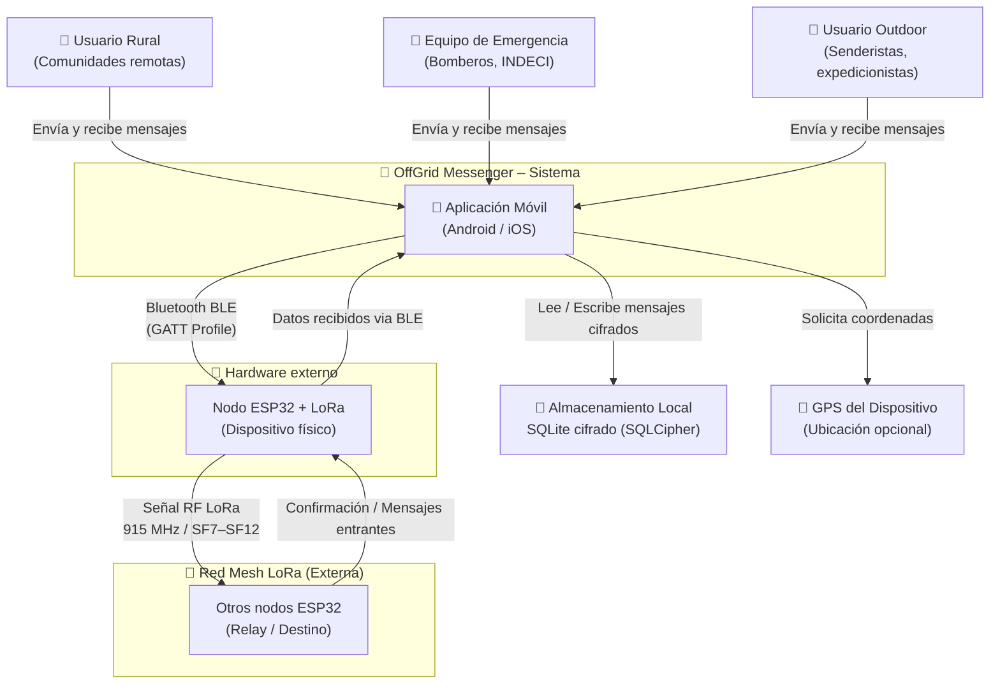
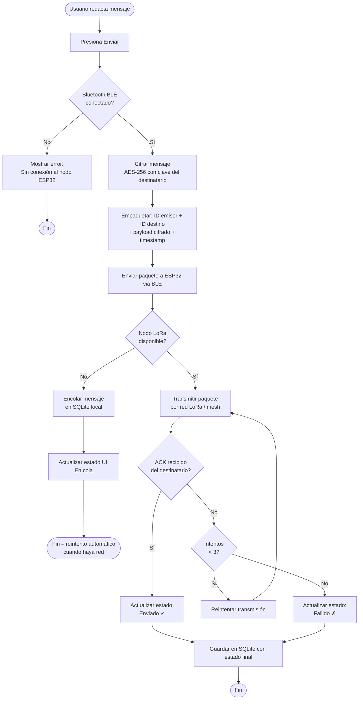
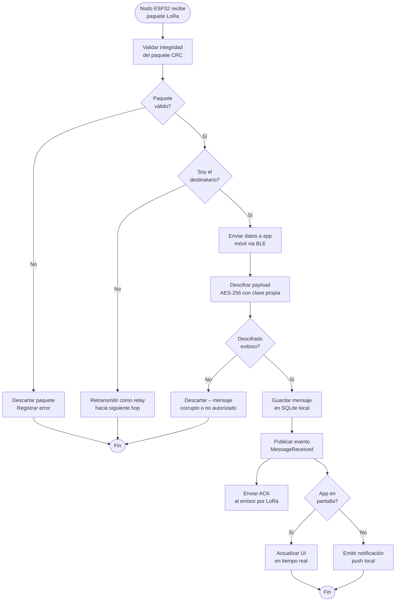
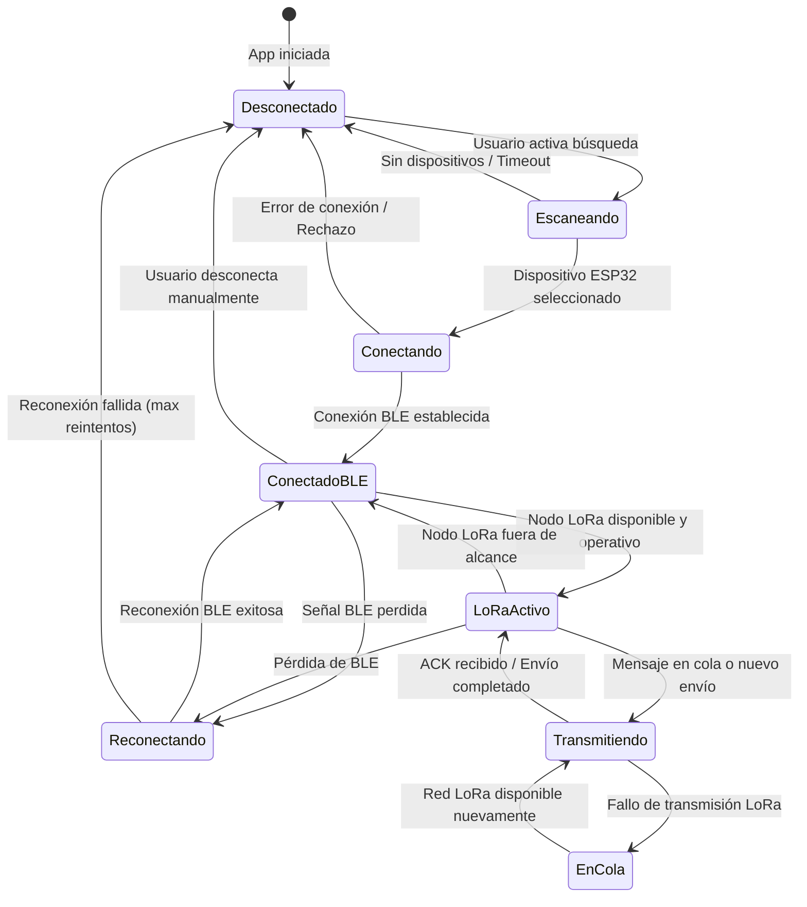
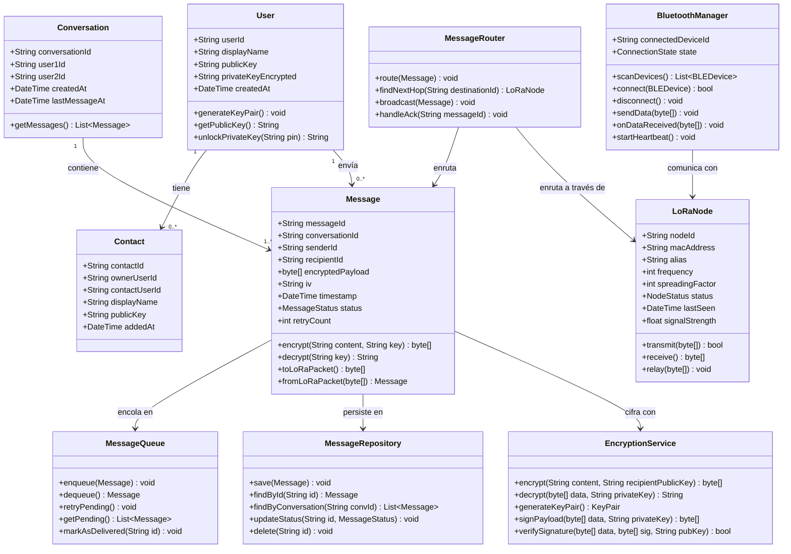
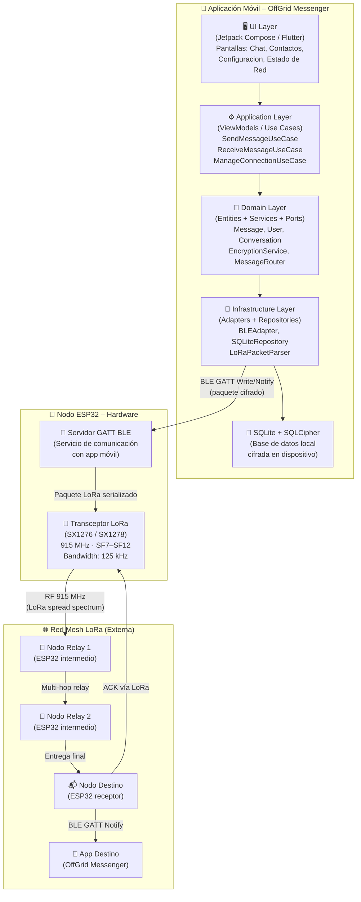
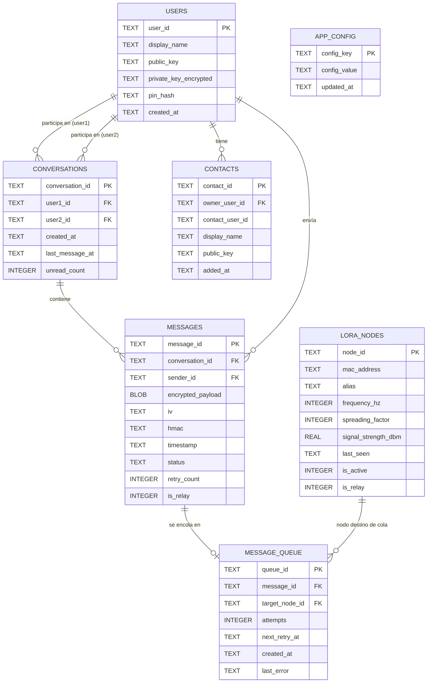

## 4.1 Design Concepts, ViewPoints & ER Diagrams
### 4.1.1 Principles Statements

| # | Principio | Descripción | Justificación |
|---|-----------|-------------|---------------|
| P-01 | **Offline-First sobre conectividad online** | El sistema debe operar completamente sin acceso a internet o servidores en la nube. Toda la lógica, almacenamiento y comunicación sucede en el dispositivo o en la red LoRa local. | El producto está diseñado para zonas sin cobertura. Depender de internet invalidaría la propuesta de valor central. |
| P-02 | **Comunicación asincrónica sobre sincrónica** | Los mensajes se tratan como eventos asincrónicos. El emisor no bloquea esperando una respuesta inmediata; el sistema entrega el mensaje cuando la red lo permite. | La tecnología LoRa tiene latencia variable (hasta segundos) y cobertura intermitente. Un modelo sincrónico generaría bloqueos inaceptables. |
| P-03 | **Seguridad por diseño (Security by Design)** | El cifrado de extremo a extremo no es una capa opcional; es parte del núcleo del dominio. Ningún mensaje puede ser transmitido o almacenado sin cifrar. | Los usuarios en emergencias y zonas rurales dependen de la privacidad de sus comunicaciones. La seguridad debe ser intrínseca, no añadida a posteriori. |
| P-04 | **Bajo consumo energético** | En cada decisión de diseño se priorizará la eficiencia energética: frecuencia de polling, compresión de payload, intervalo de heartbeat y ciclo de sueño del ESP32. | Los usuarios en emergencias pueden no tener acceso a carga eléctrica por horas o días. La duración de la batería es un atributo de calidad crítico. |
| P-05 | **Descentralización total** | El sistema no requiere un servidor central para ninguna funcionalidad. La identidad del usuario, el almacenamiento y el enrutamiento de mensajes son completamente locales o distribuidos en la red mesh. | Un servidor central sería un punto único de falla, requeriría conectividad y contradiría el modelo de negocio offline. |
| P-06 | **Persistencia local primero** | Todos los datos (mensajes, perfil, configuración) se almacenan localmente en el dispositivo con cifrado antes de cualquier transmisión. | El almacenamiento local garantiza que el historial de comunicaciones esté disponible sin conexión y que los datos no se pierdan ante fallos de red. |
| P-07 | **Simplicidad de interfaz de usuario** | La interfaz debe ser intuitiva para usuarios con baja alfabetización digital. La complejidad técnica (LoRa, BLE, cifrado) debe ser completamente transparente para el usuario final. | Los segmentos objetivo incluyen comunidades rurales y personas mayores en zonas remotas, que pueden no estar familiarizados con tecnología avanzada. |
| P-08 | **Uso de bibliotecas con soporte activo** | Se priorizará el uso de bibliotecas open-source con mantenimiento activo, comunidad y documentación (ej. SQLCipher, AES-256 estándar, protocolos BLE documentados). | Evitar dependencias huérfanas reduce el riesgo técnico a largo plazo y facilita la auditoría de seguridad. |

---

### 4.1.2 Approaches Statements – Architectural Styles & Patterns

#### Enfoque Metodológico: Domain-Driven Design (DDD)

Se adopta **Domain-Driven Design (DDD)** como metodología central para estructurar la lógica del negocio. DDD permite modelar el dominio de comunicación offline de forma explícita, separando responsabilidades en contextos delimitados (Bounded Contexts) que reflejan los subdominios identificados en los Epics del Product Backlog.

**Bounded Contexts identificados:**

| Bounded Context | Descripción | Epics relacionados |
|----------------|-------------|-------------------|
| **Messaging Context** | Gestión del ciclo de vida de los mensajes: composición, cifrado, envío, recepción, confirmación y almacenamiento. | EP-01, EP-03, EP-05 |
| **Connectivity Context** | Gestión del estado de conexión Bluetooth BLE con el nodo ESP32 y monitoreo de disponibilidad de la red LoRa. | EP-02 |
| **Identity Context** | Creación y persistencia del perfil de usuario local, gestión de par de claves pública/privada. | EP-04 |
| **Security Context** | Implementación de cifrado/descifrado AES-256 de extremo a extremo, gestión de claves y firma de mensajes. | EP-03, EP-05 |
| **Network Routing Context** | Lógica de enrutamiento multi-hop en la red mesh LoRa, gestión de nodos retransmisores, reintentos y colas. | EP-01 |

#### Estilos Arquitectónicos

**1. Arquitectura por Capas (Layered Architecture) — Aplicación Móvil**

La aplicación móvil sigue una arquitectura de cuatro capas que garantiza separación de responsabilidades y facilita el testing:

```
┌────────────────────────────────────┐
│  Capa de Presentación (UI Layer)   │  Jetpack Compose / Flutter Widgets
├────────────────────────────────────┤
│  Capa de Aplicación (App Layer)    │  ViewModels, Use Cases, Event Bus
├────────────────────────────────────┤
│  Capa de Dominio (Domain Layer)    │  Entities, Domain Services, Ports
├────────────────────────────────────┤
│  Capa de Infraestructura (Infra)   │  SQLite/SQLCipher, BLE Adapter, LoRa Adapter
└────────────────────────────────────┘
```

**2. Arquitectura Hexagonal (Ports & Adapters)**

Aplicada en la capa de dominio para desacoplar la lógica de negocio de los detalles de implementación (BLE, SQLite, LoRa). El dominio define interfaces (puertos) que son implementadas por adaptadores de infraestructura.

**3. Arquitectura Event-Driven (EDA) — Red LoRa**

Los mensajes LoRa son tratados como eventos del sistema. El componente receptor publica un evento `MessageReceived` que es consumido por los suscriptores correspondientes (UI, Storage, Acknowledgment). Esto desacopla la recepción de la presentación y permite procesamiento asíncrono.

**4. Arquitectura P2P Mesh — Red de Nodos ESP32**

La red de nodos LoRa no tiene servidor central. Cada nodo ESP32 actúa como emisor, receptor y retransmisor (relay), formando una red mesh descentralizada con enrutamiento multi-hop.

#### Patrones Arquitectónicos

| Patrón | Contexto de aplicación |
|--------|----------------------|
| **CQRS** (Command Query Responsibility Segregation) | Separación de comandos (enviar mensaje) y consultas (leer historial) para optimizar rendimiento de lectura en el historial de conversaciones. |
| **Event Bus** | Publicación y suscripción de eventos de mensajes recibidos vía LoRa, desacoplando la recepción de la notificación al usuario. |
| **Repository Pattern** | Abstracción del acceso a SQLite para mensajes, conversaciones y usuarios. |
| **Hexagonal / Ports & Adapters** | Aislamiento del dominio de las implementaciones de BLE y LoRa. |

---

### 4.1.3 Context Diagram

El diagrama de contexto del sistema (C4 – Nivel 1) muestra el sistema **OffGrid Messenger** y su relación con los actores externos y sistemas adyacentes. Representa el límite del sistema y las interacciones de alto nivel.



**Descripción de interacciones:**

| Actor / Sistema | Tipo | Interacción |
|----------------|------|-------------|
| Usuario (Rural / Emergencia / Outdoor) | Persona | Interactúa con la aplicación móvil para enviar y recibir mensajes |
| Nodo ESP32 + LoRa | Sistema externo (hardware) | Recibe datos del móvil via BLE y los transmite por radiofrecuencia LoRa |
| Red Mesh LoRa | Sistema externo (red) | Relay de mensajes entre nodos hasta alcanzar el destinatario |
| SQLite cifrado (SQLCipher) | Sistema externo (almacenamiento) | Persistencia local de mensajes, perfil y configuración |
| GPS del dispositivo | Sistema externo | Proporciona coordenadas opcionales para compartir ubicación |

---

### 4.1.4 Approach driven ViewPoints Diagrams

#### Diagrama de Actividad – Envío de Mensaje



#### Diagrama de Actividad – Recepción de Mensaje



#### Diagrama de Estado – Conexión Bluetooth / LoRa



#### Diagrama de Clases – Dominio Principal



#### Diagrama de Contenedores C4 – Nivel 2



---

### 4.1.5 Relational/Non Relational Database Diagram

OffGrid Messenger utiliza **SQLite con cifrado SQLCipher** como base de datos relacional local en el dispositivo móvil. Esta elección responde a los principios P-01 (Offline-First) y P-06 (Persistencia local primero): no existe servidor de base de datos externo, todos los datos persisten en el dispositivo del usuario.

**Justificación del modelo relacional:**
- Los datos tienen estructura bien definida y relaciones claras (mensajes → conversaciones → usuarios).
- SQLite es nativo en Android e iOS, sin dependencias adicionales.
- SQLCipher añade cifrado AES-256 transparente a nivel de archivo, cumpliendo el principio P-03.

#### Diagrama Entidad-Relación



#### Descripción de Tablas

| Tabla | Propósito | Columnas clave |
|-------|-----------|----------------|
| `USERS` | Perfil local del usuario: identidad y claves criptográficas. | `user_id` (UUID), `public_key` (Base64), `private_key_encrypted` (AES con PIN) |
| `CONVERSATIONS` | Registro de conversaciones entre dos usuarios. | `user1_id`, `user2_id` (FK a USERS), `unread_count` |
| `MESSAGES` | Mensajes enviados y recibidos, almacenados cifrados. | `encrypted_payload` (BLOB AES-256), `iv` (vector de inicialización), `hmac` (integridad), `status` (pending/sent/delivered/failed) |
| `CONTACTS` | Agenda de contactos con clave pública para cifrado. | `contact_user_id`, `public_key` (necesaria para cifrar mensajes salientes) |
| `LORA_NODES` | Nodos ESP32 conocidos con su metadata de RF. | `mac_address`, `frequency_hz`, `spreading_factor`, `signal_strength_dbm` |
| `MESSAGE_QUEUE` | Cola de mensajes pendientes de entrega por red LoRa. | `attempts`, `next_retry_at`, `last_error` (para lógica de reintento) |
| `APP_CONFIG` | Configuraciones de la aplicación (frecuencia LoRa, alias, tema). | `config_key` / `config_value` (clave-valor genérico) |

---

### 4.1.6 Design Patterns

Los siguientes patrones de diseño se aplican en la arquitectura de OffGrid Messenger para resolver problemas recurrentes de manera probada y mantenible:

| # | Patrón | Categoría | Contexto de aplicación en OffGrid Messenger |
|---|--------|-----------|----------------------------------------------|
| DP-01 | **Repository Pattern** | Acceso a datos | `MessageRepository`, `ConversationRepository`, `UserRepository` y `ContactRepository` abstraen el acceso a SQLite. El dominio interactúa con interfaces, no con SQL directamente. Facilita el testing con repositorios en memoria. |
| DP-02 | **Observer / Event Bus** | Comportamental | Un `MessageEventBus` centraliza la publicación de eventos (`MessageReceived`, `ConnectionStateChanged`, `AckReceived`). La UI y otros servicios suscriben a eventos relevantes sin acoplamiento directo al módulo BLE/LoRa. |
| DP-03 | **Strategy Pattern** | Comportamental | `EncryptionStrategy` define una interfaz común de cifrado. Implementaciones: `AES256GCMStrategy` (predeterminado) y `ChaCha20Strategy` (alternativa para dispositivos de bajo poder). Permite cambiar el algoritmo sin modificar la lógica de mensajería. |
| DP-04 | **Chain of Responsibility** | Comportamental | El enrutamiento de mensajes en la red mesh LoRa sigue una cadena: `LocalDeliveryHandler` → `DirectLoRaHandler` → `MultiHopRelayHandler` → `QueueHandler`. Cada nodo decide si procesa o delega el mensaje al siguiente eslabón. |
| DP-05 | **Singleton** | Creacional | `BluetoothManager` y `LoRaConnectionManager` son singletons dentro del ciclo de vida de la aplicación. Garantizan una única instancia de conexión activa y evitan conflictos en el acceso al hardware. |
| DP-06 | **Factory Method** | Creacional | `LoRaPacketFactory` crea paquetes LoRa tipados: `TextMessagePacket`, `AckPacket`, `HeartbeatPacket`, `LocationPacket`. Desacopla la construcción del paquete de la lógica de envío. |
| DP-07 | **Command Pattern** | Comportamental | `SendMessageCommand` encapsula una operación de envío con su estado, parámetros y lógica de reintento. Permite encolar, serializar y ejecutar comandos de forma diferida cuando la red esté disponible. |
| DP-08 | **Decorator Pattern** | Estructural | Los mensajes pasan por una cadena de decoradores antes de ser transmitidos: `CompressionDecorator` (reduce tamaño del payload LoRa) → `EncryptionDecorator` (cifra AES-256) → `SignatureDecorator` (añade HMAC). Cada decorador añade responsabilidad sin modificar la clase base. |
| DP-09 | **CQRS** | Arquitectural | Separación entre comandos (`SendMessageCommand`, `DeleteMessageCommand`) y consultas (`GetConversationHistoryQuery`, `GetUnreadCountQuery`). Las consultas usan una capa de lectura optimizada para el historial de chat. |
| DP-10 | **State Pattern** | Comportamental | `ConnectionStateMachine` gestiona los estados de la conexión BLE/LoRa: `Disconnected`, `Scanning`, `Connecting`, `ConnectedBLE`, `LoRaActive`, `Transmitting`, `Reconnecting`. Las transiciones están encapsuladas en objetos de estado. |

---

### 4.1.7 Tactics

Las tácticas arquitectónicas son decisiones de diseño que permiten lograr los atributos de calidad (Quality Attribute Requirements – QARs) identificados a partir de los Lean UX Assumptions y los Technical Stories del proyecto. Se organizan según el estándar ADD v3 del SEI.

#### Disponibilidad (Availability)

| Táctica | Descripción | Aplicación en OffGrid Messenger |
|---------|-------------|--------------------------------|
| **Heartbeat** | Señal periódica para detectar fallos en componentes. | El `BluetoothManager` envía un ping al ESP32 cada 5 segundos. Si no hay respuesta en 3 intentos, se inicia el proceso de reconexión automática (US-09). |
| **Redundant Spare** | Enrutamiento alternativo ante fallo de un nodo. | La red mesh LoRa multi-hop enruta mensajes por nodos alternativos si el camino principal no está disponible (TS-01 – Escenario 2). |
| **Exception Handling** | Captura y manejo de errores sin caída del sistema. | Los errores de transmisión LoRa se registran y el sistema continúa operativo mostrando el estado del mensaje (failed/pending) sin bloquear la UI. |
| **Message Queue** | Almacenamiento temporal ante indisponibilidad. | Los mensajes se encolan en `MESSAGE_QUEUE` (SQLite) cuando la red LoRa no está disponible y se reenvían automáticamente cuando la conexión se restaura (US-04, TS-01). |

#### Rendimiento (Performance)

| Táctica | Descripción | Aplicación en OffGrid Messenger |
|---------|-------------|--------------------------------|
| **Prioritize Events** | Procesar eventos críticos primero. | Los mensajes de tipo "emergencia" (etiquetados en el payload) tienen prioridad en la cola de transmisión LoRa sobre mensajes ordinarios. |
| **Reduce Overhead** | Minimizar datos no esenciales en la comunicación. | El `CompressionDecorator` aplica compresión ZLIB al payload antes del cifrado para reducir el tamaño del paquete LoRa (limitado a ~255 bytes por trama). |
| **Schedule Resources** | Gestión eficiente de ciclos de transmisión. | El ESP32 usa ciclos de sueño profundo (deep sleep) entre transmisiones para minimizar consumo energético, activándose solo cuando hay datos en cola. |
| **Cache** | Evitar operaciones costosas repetidas. | Las claves públicas de los contactos se cachean en memoria tras la primera lectura de SQLite para evitar consultas repetitivas durante una sesión de mensajería activa. |

#### Seguridad (Security)

| Táctica | Descripción | Aplicación en OffGrid Messenger |
|---------|-------------|--------------------------------|
| **Encrypt Data** | Cifrado de datos en tránsito y en reposo. | Cifrado AES-256-GCM de extremo a extremo en todos los mensajes (TS-05). Base de datos SQLite cifrada con SQLCipher AES-256 (TS-08, US-23). |
| **Authenticate Actors** | Verificar identidad antes de confiar en datos. | Cada mensaje incluye un HMAC firmado con la clave privada del emisor. El receptor verifica la firma antes de descifrar el contenido. |
| **Limit Access** | Restricción de acceso a datos sensibles. | La clave privada del usuario se almacena cifrada con el PIN del usuario. No se almacena en texto plano en ningún momento (US-23, TS-08). |
| **Validate Input** | Verificar integridad de datos recibidos. | Cada paquete LoRa recibido es validado por CRC antes de procesarse. Los paquetes con CRC incorrecto se descartan inmediatamente (TS-02 – Escenario 2). |

#### Modificabilidad (Modifiability)

| Táctica | Descripción | Aplicación en OffGrid Messenger |
|---------|-------------|--------------------------------|
| **Increase Cohesion** | Cada módulo tiene una responsabilidad bien definida. | Los Bounded Contexts DDD (Messaging, Connectivity, Identity, Security) delimitan claramente las responsabilidades. Cambios en un contexto no afectan a otros. |
| **Reduce Coupling** | Minimizar dependencias entre módulos. | La arquitectura hexagonal con puertos/adaptadores desacopla el dominio de los detalles de BLE y SQLite. Cambiar de BLE a Wi-Fi Direct requeriría solo reemplazar el adaptador. |
| **Defer Binding** | Configuración adaptable en tiempo de ejecución. | La frecuencia LoRa (915 MHz para Perú, 868 MHz para Europa) y el Spreading Factor son configurables desde `APP_CONFIG` sin recompilar la aplicación. |
| **Use Intermediary** | Desacoplar mediante intermediarios. | El `MessageEventBus` actúa como intermediario entre el módulo de recepción LoRa y la UI/Storage, permitiendo agregar nuevos suscriptores sin modificar el emisor. |

#### Usabilidad (Usability)

| Táctica | Descripción | Aplicación en OffGrid Messenger |
|---------|-------------|--------------------------------|
| **Maintain Task Model** | Flujo de usuario familiar e intuitivo. | La interfaz de chat replica el modelo mental de WhatsApp/Telegram: lista de conversaciones, burbuja de mensajes, estado de entrega. El usuario no necesita entender LoRa para usarla. |
| **Support User Initiative** | El sistema actúa de forma proactiva. | La reconexión automática BLE (US-09) y el reenvío automático de mensajes en cola ocurren sin que el usuario deba intervenir. |
| **Aggregate Data** | Presentar información consolidada. | La pantalla principal muestra el estado unificado del sistema: ícono de conexión BLE, estado de la red LoRa, mensajes no leídos y último mensaje por conversación. |
| **Provide Feedback** | El sistema informa el estado de las operaciones. | Cada mensaje muestra su estado en tiempo real: `Enviando… → Enviado ✓ → Entregado ✓✓ / Fallido ✗`, informando al usuario sin terminología técnica. |
