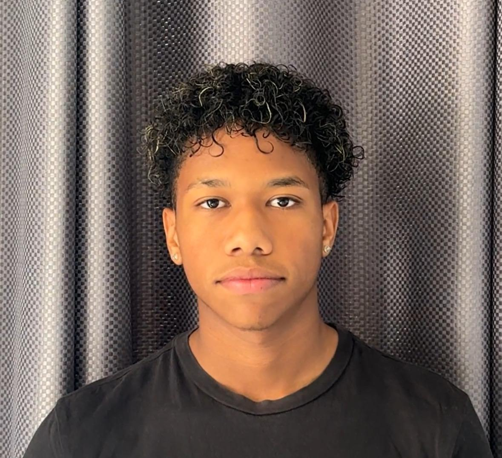

 

# **UNIVERSIDAD PERUANA DE CIENCIAS APLICADAS**

### **Facultad de Ingeniería**
### **Carrera de Ingeniería de Software**

 

# **Informe de Trabajo Final**

## **Startup:** `LoRaLink`
## **Producto:** `OffGrid Messenger`

 

**Curso:** Fundamentos de Arquitectura de Software  

**Sección:** 17949

**Docente:** **Jorge Luis Delgado**

 

### **Relación de Integrantes:**

| Apellidos y Nombres | Código |
| :--- | :---: |
| **Juan Carlos Angulo Abud** | `u202317692` |
| **Renzo Paul Retuerto Zapata** | `u202320328` |
| **Renzo Sebastián Uribe Livia** | `u202311745` |
| **Oscar Leonardo Espinoza Quijandria** | `u202311842` |
| **Landauri Preciado, Stephano Mayrzon** | `u202311828` |

 

---

 

**Ciclo 2026 - 01** **Lima, Perú**

---
# Registro de Versiones del Informe

| Versión   | Fecha       | Autor | Descripción de modificación |
|----------|------------|-------|-----------------------------|
| Avance 1 | 15/04/2026 | - Uribe Livia Renzo Sebastián   - Espinoza Quijandria Oscar Leonardo   - Angulo Abud Juan Carlos   - Retuerto Zapata Renzo Paul   - Landauri Preciado Stephano Mayrzon | Se han incluido los siguientes capítulos:   - Capítulo I: Introducción   - Capítulo II: Requirements Elicitation & Analysis   - Capítulo III: Requirements Specification |

## Contenido

1.1 Startup Profile

1.1.1 Descripción de la Startup

1.1.2 Perfiles de integrantes del equipo

1.2 Solution Profile

1.2.1 Nombre del producto

1.2.2 Antecedentes y problemática

1.2.3 Lean UX Process

1.2.3.1 Lean UX Problem Statement

1.2.3.2 Lean UX Assumptions

1.2.3.3 Lean UX Hypothesis

1.2.3.4 Lean UX Canvas

1.3 Segmentos objetivo

2.1 Competidores

2.2 Entrevistas

2.3 Needfinding

2.3.1 User Personas

2.3.2 User Task Matrix

2.3.3 Empathy Maps

2.3.4 As-is Scenario Mapping

3.1 To-Be Scenario Mapping

3.2 User Stories

3.3 Impact Map

3.4 Product Backlog

# Student Outcome

# Student Outcome
| **Criterio Específico** | **Acciones Realizadas** | **Conclusiones** |
|--------------------------|-------------------------------------------------------------------------------------------------------------------------------------------------------------------------------------------------------------------------------------------------------------------------------------------------------------------------------------------------------------------------------------------------------------------------------------------------------------------------------------------------------------------------------------------------------------------------------------------------------------------------------------------------------------------------------------------------------------------------------------------------------------------------------------------------------------------------------------------------------------------------------------------------------------------------------------------------------------------------------------------------------------------------------------------------------------------------------------------------------------------------------------------------------------------------------------------------------------------------------------------------------------------------------------------------------------------------------------------------------------------------------------------------------------------------------------------------------------------------------------------------------------------------------------------------------------------------------------------------------------------------------------------------------------------------------------------------------------------------------------------------------------------------------------------------------------------------------------------------------------------------------------------------------------------------------------------------------------------------------------------------------------------------------------------------------------------------------------------------------------------------------------------------------------------------------------------------------------------------------------------------------------------------------------------------------------------------------------------------------------------------------------------------------------------------------------------------------------------------------------------------------------------------------------------------------------------------------------------------------------------------------------------------------------------------------------------------------------------------------------------------------------------------------------------------------------------------------------------------------------------------------------------------------------------------------------------------------------------------------------------------------------------------------------------------------------------------------------------------------------------------------------------------------------------------------------------------------------------------------------------------------------------------------------------|----------------------------|
| **Comunica por escrito con efectividad a diferentes rangos de audiencia.** | **Axel Randall Ordoñez Ricaldi:** **Acciones TB1:** Redactó de manera clara y estructurada la documentación del perfil de la Startup, incluyendo la descripción de ThermaTrace, el problem statement bajo Lean UX, y el product backlog con historias de usuario detalladas. Su escritura técnica facilitó la comprensión del alcance del proyecto tanto para el equipo como para stakeholders externos.  **Acciones TP1:** Durante el Sprint 2, documenté por escrito el módulo de Medicaments en el Sprint Backlog 2, detallando las tareas de implementación del catálogo con cards de medicamentos (T22-T26), incluyendo descripciones técnicas precisas de cada funcionalidad. Elaboré mensajes de commit descriptivos siguiendo convenciones Conventional Commits (feat:, fix:, docs:) que facilitaron la trazabilidad del desarrollo. Redacté la documentación técnica del formulario de agregar medicamentos con cálculo automático de status, explicando la lógica de negocio y validaciones implementadas. Contribuí a la sección 5.2.2.4 (Development Evidence for Sprint Review) documentando los commits más relevantes del bounded context de Medicaments.  **Acciones TB2:** Durante el Sprint 3, desarrollé y documenté el módulo **Medicaments** en el backend bajo **Spring Boot**, implementando los endpoints CRUD (GET, POST, PUT, DELETE) conectados a la base de datos **MySQL**. Redacté descripciones técnicas sobre la lógica de negocio, validaciones de datos, excepciones controladas y pruebas con Postman. Además, generé documentación en **Swagger** explicando cada endpoint y su propósito. Los mensajes de commit siguieron las convenciones **Conventional Commits**, manteniendo trazabilidad clara del desarrollo.  **Acciones TF:** Durante el Sprint 4 (TF), validé el despliegue completo del módulo **Medicaments**, verificando la correcta integración entre **backend, base de datos MySQL y frontend**. Comprobé el funcionamiento de los endpoints desplegados mediante **Swagger UI** y colaboré en la consolidación de evidencias técnicas que formaron parte del cierre del informe final.  **Fabrizio Martin Panta Castro:** **Acciones TB1:** Redactó la documentación de entrevistas, style guidelines, information architecture y landing page UI design con un nivel de detalle técnico apropiado para diseñadores y desarrolladores. Su comunicación escrita en el reporte técnico demostró dominio de terminología UX/UI y capacidad de síntesis.  **Acciones TP1:** En el Sprint 2, documenté por escrito el módulo de Configuration en el Sprint Backlog 2, especificando las tareas de desarrollo de componentes de preferencias y seguridad (T27-T30) con descripciones claras y estimaciones precisas. Elaboré commits con mensajes descriptivos que documentan cada avance en la implementación de formularios de configuración y servicios de persistencia. Redacté la documentación de preferencias del sistema (idioma, zona horaria, notificaciones) y la sección de seguridad, explicando la arquitectura de servicios y la integración con JSON Server. Mi comunicación escrita en el código (comentarios técnicos, JSDoc) facilitó la comprensión de la lógica implementada por otros miembros del equipo.  **Acciones TB2:** Durante el Sprint 3, desarrollé el módulo **Configuration & Preferences** en **Spring Boot**, documentando la implementación de endpoints REST y su persistencia en **MySQL**. Agregué comentarios técnicos detallados y documenté los endpoints en **Swagger**.  **Acciones TF:** Durante el Sprint 4 (TF), verifiqué el despliegue completo del módulo **Configuration & Preferences**, validando la correcta exposición de endpoints en **Swagger**, su integración con la base de datos y su funcionamiento en el entorno final desplegado.  **Jean Pierre Grandez Mansilla:** **Acciones TB1:** Elaboró wireframes y mockups de la landing page y coordinó el trabajo colaborativo mediante Miro y reuniones grupales, integrando los aportes del equipo en una propuesta visual coherente.  **Acciones TP1:** Durante el Sprint 2, lideró la documentación escrita de la arquitectura base del proyecto, la configuración de Angular 20, el sistema de internacionalización (i18n) y el deployment en Netlify, redactando secciones técnicas del reporte con enfoque profesional.  **Acciones TB2:** Durante el Sprint 3, lideró la documentación y configuración general del **backend de ThermaTrace**, estructurándolo bajo arquitectura **DDD**, documentando entidades, servicios, repositorios y Swagger.  **Acciones TF:** Durante el Sprint 4 (TF), lideró el **despliegue completo del sistema**, incluyendo **backend, frontend y base de datos MySQL**, validando la correcta exposición de endpoints en **Swagger** y consolidando el cierre técnico del informe final.  **Oscar Espinoza Quijandria:** **Acciones TB1:** Lideró la implementación técnica inicial del proyecto y la elaboración de diagramas UML, organizando el Sprint Backlog 1 y asegurando una base técnica sólida.  **Acciones TP1:** Durante el Sprint 2, documentó el módulo Dashboard/Home y la arquitectura de visualización de métricas, elaborando commits descriptivos y secciones del reporte técnico.  **Acciones TB2:** Durante el Sprint 3, desarrolló y documentó el módulo **Dashboard & Metrics** en el backend, incluyendo endpoints REST, documentación en **Swagger** y pruebas con Postman.  **Acciones TF:** Durante el Sprint 4 (TF), aseguró la integración final del **Dashboard**, validando el despliegue completo del sistema, la correcta conexión con la base de datos y la disponibilidad total de los endpoints en **Swagger**.  **Frezzia Eldaa Isabel Espinoza Paredes:** **Acciones TB1:** [Pendiente de completar por la integrante]  **Acciones TP1:** Durante el Sprint 2, documentó el módulo User/Profile, desarrollando formularios reactivos con validaciones y documentación técnica clara para diferentes audiencias. | **Conclusión grupal TB1:** El equipo demostró capacidad de comunicación escrita efectiva al producir documentación técnica clara y estructurada, orientada a audiencias técnicas y no técnicas.  **Conclusión grupal TP1:** Durante el Sprint 2, el equipo consolidó su comunicación escrita técnica mediante Sprint Backlogs detallados, commits descriptivos y documentación técnica de los módulos del frontend.  **Conclusión grupal TB2:** En el Sprint 3, la comunicación escrita permitió documentar con precisión el backend de ThermaTrace, sus endpoints, servicios y arquitectura bajo DDD.  **Conclusión grupal TF:** Durante el Sprint 4 (TF), el equipo logró el **despliegue completo del sistema ThermaTrace al 100%**, integrando correctamente **frontend, backend y base de datos MySQL**, con todos los **endpoints expuestos y validados en Swagger**, y cerrando satisfactoriamente el informe técnico final del proyecto. |

# Capítulo I: Introducción

## 1.1 Startup Profile

### 1.1.1 Descripción de la Startup
Somos una startup dedicada a revolucionar la conectividad en zonas críticas mediante el desarrollo de sistemas de comunicación alternativa. Nuestra propuesta combina la potencia de la tecnología **IoT** y redes de largo alcance (**LoRa**) con aplicaciones móviles de última generación, permitiendo crear redes descentralizadas e independientes de la infraestructura de internet convencional. 

### 1.1.2 Perfiles de integrantes del equipo
El equipo está conformado por estudiantes de Ingeniería de Software con competencias complementarias en el ciclo de vida de desarrollo:

| Integrante | Descripción |
| :---: | :--- |
|  **Juan Carlos Angulo Abud** | Especialista en análisis de requerimientos y lógica de negocio. |
|  **Renzo Paul Retuerto Zapata** | Enfocado en arquitectura de sistemas, integración de hardware IoT y desarrollo backend. |
|  **Renzo Sebastián Uribe Livia** | Responsable del diseño de interfaces de usuario y aseguramiento de la calidad del software. |
|  **Oscar Leonardo Espinoza Quijandria** | Encargado de la arquitectura del sistema y desarrollo del backend e integración Bluetooth–LoRa. |
|  **Stephano Landauri Perciado** | Responsable del análisis de necesidades reales en entornos sin conectividad y alineación de la solución con los segmentos objetivo. |

---

# 1.2 Solution Profile

### 1.2.1 Nombre del producto
El producto desarrollado llevará el nombre de **OffGrid Messenger**, una solución de mensajería descentralizada basada en tecnología **LoRa** ya que representa una plataforma de mensajería capaz de operar sin conexión a redes tradicionales, enfocada en comunicación descentralizada y de largo alcance.

### 1.2.2 Antecedentes y problemática
Hoy en día, quedarse sin señal en una zona remota o durante una emergencia no debería ser una limitación. Hemos diseñado una solución de comunicación independiente que rompe la dependencia del internet tradicional mediante el uso de tecnología **IoT (ESP32 y LoRa)**. 

> Nuestra plataforma permite que cualquier celular se mantenga conectado a largas distancias, utilizando dispositivos de bajo consumo que actúan como puentes de comunicación segura. Es una red privada y cifrada, pensada para proteger y conectar a las personas donde las redes convencionales simplemente no llegan.

---
## 1.2.3 Lean UX Process

### 1.2.3.1 Lean UX Problem Statement

| Sección | Detalle del Problem Statement |
| :--- | :--- |
| **El problema** | Los usuarios en zonas rurales, remotas y durante emergencias enfrentan la imposibilidad de comunicarse cuando no tienen acceso a redes móviles tradicionales o internet, lo que genera aislamiento, riesgos de seguridad y limitaciones en la coordinación de actividades críticas. |
| **¿Para quién?** | • Personas en zonas de baja cobertura celular • Equipos de respuesta ante emergencias • Usuarios de actividades outdoor (senderismo, camping, expediciones) • Comunidades rurales desconectadas |
| **El impacto** | • Incapacidad de pedir ayuda en situaciones de emergencia • Pérdida de coordinación en equipos de trabajo remoto • Aislamiento de comunidades durante desastres naturales • Inseguridad personal en zonas sin conectividad |
| **Solución** | **OffGrid Messenger** es una plataforma de mensajería descentralizada que utiliza tecnología LoRa e IoT (ESP32) para crear redes privadas de comunicación independientes. |

---

### 1.2.3.2 Lean UX Assumptions

#### 🟦 Suposiciones sobre el Usuario
* **Suposición 1: Necesidad de Comunicación Alternativa**
    * Los usuarios en zonas rurales y remotas necesitan realmente una alternativa de comunicación cuando no tienen acceso a redes móviles tradicionales.
    * Los usuarios enfrentan situaciones donde la falta de comunicación representa un riesgo real (emergencias, coordinación de actividades).
    * **A validar mediante:** Entrevistas con usuarios objetivo, análisis de incidentes de emergencia en zonas remotas.

* **Suposición 2: Disposición a Usar Dispositivos Adicionales**
    * Los usuarios están dispuestos a adoptar dispositivos LoRa adicionales si mejora significativamente su conectividad.
    * Los usuarios entienden el valor de una red descentralizada y están motivados a participar en ella.
    * **A validar mediante:** Encuestas de aceptación de tecnología, pruebas con usuarios beta.

* **Suposición 3: Priorización de Privacidad y Seguridad**
    * Los usuarios en emergencias y zonas remotas priorizan la privacidad de sus comunicaciones.
    * Los usuarios confían en soluciones con cifrado de extremo a extremo para proteger información sensible.
    * Los usuarios entienden y valoran la diferencia entre redes privadas descentralizadas y redes públicas.
    * **A validar mediante:** Estudios de preferencia de usuarios, análisis de preocupaciones de seguridad.

* **Suposición 4: Capacidad de Uso sin Conocimientos Técnicos Avanzados**
    * Los usuarios de zonas rurales pueden operar la aplicación móvil sin requerir entrenamiento técnico extenso.
    * Los usuarios pueden realizar setup de dispositivos LoRa con instrucciones simples.
    * La interfaz móvil intuitiva es suficiente para usuarios con baja alfabetización digital.
    * **A validar mediante:** Pruebas de usabilidad con usuarios objetivo, medición de tiempo de aprendizaje.

* **Suposición 5: Accesibilidad Económica**
    * Los usuarios target pueden permitirse el costo de nodos LoRa y suscripción al servicio.
    * El precio es competitivo comparado con soluciones alternativas (satélites, radios profesionales).
    * **A validar mediante:** Análisis de viabilidad económica, encuestas de disposición a pagar.

#### 🟩 Suposiciones sobre el Producto
* **Suposición 6: Viabilidad Técnica de Cobertura LoRa**
    * La tecnología LoRa puede alcanzar distancias de 5-10 km en línea de vista en terreno rural de Perú.
    * La cobertura real en terreno montañoso/Amazonía alcanza al menos 3-5 km con retransmisión multi-hop.
    * Los nodos LoRa funcionan confiablemente en condiciones ambientales de Perú (lluvia, temperatura, altitud).
    * **A validar mediante:** Pruebas de campo en zonas piloto, medición de cobertura real vs. simulada.

* **Suposición 7: Rendimiento de Mensajería Aceptable**
    * El tiempo de entrega de mensajes es menor a 2 segundos en condiciones normales.
    * La tasa de entrega exitosa es ≥80% incluso con red congestionada.
    * El throughput de mensajes es suficiente para comunicación en tiempo real.
    * **A validar mediante:** Pruebas de rendimiento en laboratorio y campo, monitoreo de SLA.

* **Suposición 8: Eficiencia Energética de Dispositivos**
    * Los dispositivos móviles consumen <10% de batería por hora en modo de comunicación activa.
    * Los nodos LoRa pueden funcionar 48+ horas con batería estándar.
    * El consumo de energía es aceptable incluso en uso intensivo durante emergencias.
    * **A validar mediante:** Pruebas de autonomía de batería, medición de consumo en diferentes escenarios.

* **Suposición 9: Escalabilidad de la Red Descentralizada**
    * La arquitectura descentralizada puede soportar 100+ nodos simultáneamente sin degradación crítica.
    * El protocolo multi-hop permite cobertura expandida sin servidor central.
    * La red puede auto-organizarse y recuperarse de fallos de nodos individuales.
    * **A validar mediante:** Pruebas de carga, simulaciones de redes grandes, resiliencia ante fallos.

* **Suposición 10: Seguridad del Cifrado Implementado**
    * El cifrado de extremo a extremo es resistente a ataques comunes (sin auditoría profesional).
    * La implementación en ESP32 es criptográficamente segura sin comprometer rendimiento.
    * Las claves se pueden gestionar sin compromiso de seguridad en dispositivos de bajo poder.
    * **A validar mediante:** Auditoría de seguridad profesional, testing de penetración.

#### 🟧 Suposiciones sobre el Negocio
* **Suposición 11: Demanda Real en el Mercado**
    * Existe una demanda genuina en zonas rurales y equipos de emergencia de Perú.
    * El mercado objetivo está dispuesto a cambiar de solución actual o adoptar nueva tecnología.
    * El tamaño del mercado es lo suficientemente grande para viabilidad comercial.
    * **A validar mediante:** Estudios de mercado, encuestas, entrevistas con potenciales clientes.

* **Suposición 12: Modelo de Negocio Viable**
    * Los usuarios pagarían suscripción mensual por servicio premium (backup en cloud, análisis, etc.).
    * La venta de nodos LoRa genera margen de ganancia suficiente para sostenibilidad.
    * Los costos operativos son menores que los ingresos proyectados.
    * **A validar mediante:** Modelo financiero, análisis de rentabilidad, forecasting de adopción.

* **Suposición 13: Oportunidad de Alianzas Institucionales**
    * Instituciones públicas (INDECI, bomberos, municipalidades) buscan soluciones como OffGrid Messenger.
    * Las alianzas públicas son viables y escalables como canal de distribución.
    * El gobierno puede financiar o subsidiar soluciones de conectividad para zonas rurales.
    * **A validar mediante:** Contacto con instituciones, análisis de procurement público, pilotos institucionales.

* **Suposición 14: Factibilidad de Fabricación y Distribución**
    * Los costos de manufactura de nodos LoRa son económicamente competitivos en volumen.
    * Existe cadena de suministro viable para componentes LoRa en Perú/Latinoamérica.
    * La distribución a zonas rurales es logísticamente factible sin costos prohibitivos.
    * **A validar mediante:** Cotizaciones de manufactura, análisis de supply chain, logística piloto.

#### 🟨 Suposiciones sobre Regulación y Cumplimiento
* **Suposición 15: Regulación de Espectro LoRa Favorable**
    * El espectro LoRa (ISM 915 MHz o similar) es de uso libre en Perú sin licencia requerida.
    * No existen restricciones legales para operación de redes LoRa privadas descentralizadas.
    * La regulación MITC/MTC permite el despliegue sin interferencias legales.
    * **A validar mediante:** Investigación regulatoria, consulta con abogados especializados, MITC.

* **Suposición 16: Privacidad de Datos Conforme a Normativa**
    * La solución cumple con LPDP (Ley de Protección de Datos Personales) de Perú.
    * El almacenamiento local de mensajes es legal bajo normativa de privacidad.
    * No hay obligación de retención de datos en servidores centrales.
    * **A validar mediante:** Asesoría legal, compliance audit, AEPD.

---

### 1.2.3.3 Lean UX Hypothesis

 **Hipótesis 1: Mensajería Cifrada de Extremo a Extremo**
> * **Si** [usuarios en zonas remotas y durante emergencias]
> * **Logran** [comunicación privada y segura sin exposición de datos]
> * **Con** [cifrado de extremo a extremo en todos los mensajes]
> * **Creemos que** los usuarios adoptarán OffGrid Messenger porque garantiza que sus comunicaciones críticas en emergencias no serán interceptadas, lo cual es esencial para equipos de respuesta y comunidades vulnerables.

 **Hipótesis 2: Cobertura de Largo Alcance con LoRa**
> * **Si** [usuarios en zonas rurales sin cobertura celular]
> * **Logran** [capacidad de comunicarse a distancias de 5-10 km sin infraestructura tradicional]
> * **Con** [red descentralizada de nodos LoRa que funcionan como retransmisores (multi-hop)]
> * **Creemos que** al distribuir nodos LoRa en puntos estratégicos, los usuarios podrán mantener conectividad continua en áreas donde actualmente no existe cobertura, resolviendo el aislamiento en zonas remotas.

 **Hipótesis 3: Interfaz Móvil Intuitiva y Accesible**
> * **Si** [usuarios con diferentes niveles de habilidad técnica]
> * **Logran** [capacidad de usar la app sin necesidad de configuración técnica compleja]
> * **Con** [interfaz móvil simple, con setup automático de nodos y visualización clara del estado de la red]
> * **Creemos que** una app fácil de usar sin requerir conocimientos técnicos avanzados aumentará la adopción incluso en comunidades rurales con baja alfabetización digital.

 **Hipótesis 4: Bajo Consumo de Energía en Dispositivos Móviles**
> * **Si** [usuarios que dependen de baterías en zonas sin electricidad]
> * **Logran** [duración extendida de la batería del dispositivo móvil durante comunicación]
> * **Con** [optimización del consumo de energía en la conexión LoRa y procesamiento local de mensajes]
> * **Creemos que** minimizar el consumo de batería permitirá que los usuarios mantengan comunicación durante períodos extendidos sin acceso a energía, crítico en emergencias.

 **Hipótesis 5: Sincronización Automática en Modo Offline**
> * **Si** [usuarios en zonas con conectividad intermitente]
> * **Logran** [entrega confiable de mensajes incluso cuando hay desconexiones temporales]
> * **Con** [almacenamiento local de mensajes y sincronización automática cuando la red se recupera]
> * **Creemos que** permitir el trabajo offline sin perder mensajes eliminará la frustración de usuarios en zonas de cobertura inconsistente y mejorará la experiencia general.

 **Hipótesis 6: Cumplimiento Regulatorio y Legalidad**
> * **Si** [usuarios en Perú y zonas Latinoamericanas]
> * **Logran** [operación legal y sin interferencias de frecuencias reguladas]
> * **Con** [uso de espectro LoRa libre (banda ISM 915 MHz o similar según regulación local)]
> * **Creemos que** operar dentro del marco regulatorio correcto garantizará que la solución sea escalable sin riesgos legales y generará confianza en usuarios institucionales como equipos de emergencia.

---

### 📊 Métricas de Validación Sugeridas

| Hipótesis | Métrica de Validación | Objetivo / Criterio de Éxito |
| :--- | :--- | :--- |
| **H1: Seguridad** | Auditoría de seguridad y reporte de confianza | Encriptación verificada; 90%+ de usuarios confían en la privacidad. |
| **H2: Cobertura** | Pruebas de campo en terreno real | Alcance de 5-10 km; 80%+ de mensajes entregados con éxito. |
| **H3: Usabilidad** | Pruebas de usuario (User Testing) | Tiempo de setup < 2 min; 85%+ de éxito sin soporte técnico. |
| **H4: Energía** | Monitoreo de consumo de batería | Consumo < 10% por hora (activo); duración de 24+ horas. |
| **H5: Offline** | Pruebas de estrés y reconexión | 95%+ de entrega tras reconexión; pérdida de datos < 1%. |
| **H6: Legal** | Certificación regulatoria y escaneo de espectro | Certificación obtenida; 0 incidentes de interferencia. |

---
### 1.2.3.4 Lean UX Canvas

---

# 1.3 Segmentos Objetivo

El producto está dirigido a usuarios que requieren comunicación en entornos donde la conectividad a internet o redes móviles es limitada o inexistente. A continuación, se detallan los segmentos objetivo identificados:

### 1. Usuarios en zonas rurales o con baja conectividad
Este segmento abarca a pobladores y trabajadores en áreas geográficas donde las operadoras de red tradicionales no tienen cobertura debido a la dificultad del terreno (sierra y selva).
* **Perfil:** Agricultores, ganaderos y comunidades rurales aisladas.
* **Necesidad:** Mantener contacto con familiares y coordinar actividades comerciales o de salud básicas.
* **Caso de Uso:** Envío de alertas ante emergencias médicas o coordinación de logística para el transporte de productos sin depender de una señal de celular costosa o inexistente.

### 2. Usuarios en actividades al aire libre (Outdoor)
Dirigido a entusiastas del deporte y la aventura que exploran rutas fuera del alcance de las torres de comunicación.
* **Perfil:** Senderistas (trekkers), montañistas, ciclistas de montaña y grupos de expedición.
* **Necesidad:** Mantener la comunicación entre los miembros del grupo y contar con un mecanismo de auxilio en zonas remotas.
* **Caso de Uso:** Localización de miembros del grupo en rutas de trekking y envío de señales de "S.O.S" con coordenadas exactas en caso de accidentes o extravío.

### 3. Equipos de emergencia y contingencia
Organizaciones que operan en escenarios de desastres naturales o situaciones críticas donde la infraestructura de red convencional ha colapsado.
* **Perfil:** Brigadistas, bomberos, equipos de rescate y personal de organizaciones como **INDECI**.
* **Necesidad:** Una red de comunicación resiliente, privada y fácil de desplegar para coordinar operaciones de rescate.
* **Caso de Uso:** Establecimiento de una red de mensajería instantánea para la coordinación de brigadas durante inundaciones o sismos, donde las antenas de telefonía suelen quedar inoperativas.

### 4. Empresas de Logística y Operaciones en Campo (Segmento Adicional)
Empresas que poseen activos o personal en movimiento en zonas industriales o mineras remotas.
* **Perfil:** Supervisores de obra, transportistas en rutas críticas y personal de mantenimiento técnico.
* **Necesidad:** Monitoreo y comunicación de bajo costo energético y alta disponibilidad.
* **Caso de Uso:** Reporte de estado de maquinaria o confirmación de llegada a puntos de control en zonas mineras donde el satélite es demasiado costoso.

---

# Capítulo II: Requirements Development and Software Solution Design

## 2.1. Competidores
| Categoría | OffGrid Messenger | Meshtastic | goTenna | MeshCore | Bitchat |
|----------|------------------|------------|----------|----------|---------|
| Perfil – Overview | Sistema de comunicación privada P2P basado en LoRa, sin internet, diseñado para entornos remotos. Permite enviar mensajes encriptados de forma segura y confiable entre usuarios. | Plataforma open-source de comunicación off-grid basada en LoRa que permite enviar mensajes sin internet mediante red mesh. | Dispositivo + app que permite enviar mensajes y ubicación sin señal celular usando red mesh propia. | Plataforma LoRa descentralizada para comunicación encriptada off-grid con enfoque en redes resilientes. | App de mensajería P2P basada en Bluetooth que funciona sin internet ni servidores. |
| Ventaja competitiva | Comunicación encriptada, fácil de usar y enfocada en usuarios reales (empresas, emergencias y outdoor), sin depender de infraestructura externa. | Gran comunidad, bajo costo y compatibilidad con múltiples dispositivos. | Solución comercial lista para usar, con buena experiencia de usuario. | Alta seguridad y descentralización. | No requiere hardware adicional. |
| Mercado objetivo | Empresas en zonas remotas, campamentos, equipos de emergencia y usuarios outdoor. | Usuarios técnicos, outdoor y comunidad open-source. | Viajeros, rescate, militar y outdoor. | Desarrolladores y comunidades técnicas. | Usuarios urbanos o comunicación cercana. |
| Estrategias de marketing | Validación en campo, alianzas con empresas, enfoque en seguridad y casos reales de uso. | Comunidad open-source, foros y GitHub. | Marketing enfocado en seguridad y aventura. | Comunidad técnica y desarrollo colaborativo. | Difusión mediática y enfoque en privacidad. |
| Productos & Servicios | Dispositivo LoRa + app móvil + comunicación encriptada + red P2P. | Software + app + dispositivos compatibles. | Hardware propietario + app móvil. | Software + integración con hardware LoRa. | App móvil. |
| Precios & Costos | Modelo por definir (posible venta de dispositivo + servicio). | Bajo costo (open-source). | Alto (hardware propietario). | Bajo (open-source). | Gratuito. |
| Canales de distribución | App móvil + distribución de hardware + alianzas empresariales. | Web, comunidad, tiendas de hardware. | Tienda oficial y distribuidores. | Web y comunidad. | App stores. |
| Fortalezas | Solución práctica, segura y adaptable a múltiples sectores reales. | Gran comunidad y adopción creciente. | Producto probado y confiable. | Seguridad avanzada. | Fácil acceso. |
| Debilidades | Proyecto en etapa inicial, requiere adopción. | Configuración técnica compleja. | Costo elevado. | Baja adopción. | Alcance limitado. |
| Oportunidades | Crecimiento en sectores sin conectividad y emergencias. | Expansión global de comunidad. | Nuevos mercados profesionales. | Integración con IoT. | Evolución tecnológica. |
| Amenazas | Competidores tecnológicos y barrera de adopción. | Nuevas soluciones más simples. | Alternativas más económicas. | Competencia con Meshtastic. | Limitaciones técnicas frente a LoRa. |
## 2.2. Entrevistas
### 2.2.1 Diseño de entrevistas
---

### Segmento Objetivo #1: Usuarios en zonas rurales o con baja conectividad

#### Preguntas

1. ¿Con qué frecuencia tienes problemas de señal en tu zona?
2. Cuando no tienes señal, ¿cómo haces para comunicarte con otras personas?
3. ¿Qué situaciones se te han complicado por no poder comunicarte?
4. ¿Qué tan importante es para ti poder enviar mensajes en cualquier momento?
5. ¿Has tenido alguna emergencia donde no pudiste comunicarte?
6. ¿Qué es lo que más te molesta de no tener buena conectividad?
7. ¿Usas algún otro medio de comunicación aparte del celular?
8. ¿Qué tan lejos necesitas comunicarte normalmente?
9. ¿Preferirías un sistema que funcione sin internet ni señal móvil?
10. ¿Qué tan fácil debería ser usar un nuevo dispositivo de comunicación para ti?

---

### Segmento Objetivo #2: Usuarios en actividades al aire libre (outdoor)

#### Preguntas

1. ¿Con qué frecuencia realizas actividades en lugares sin señal?
2. ¿Qué haces normalmente para mantenerte comunicado en esos lugares?
3. ¿Alguna vez te has sentido inseguro por no tener señal?
4. ¿Qué situaciones podrían volverse peligrosas por falta de comunicación?
5. ¿Qué tan importante es para ti poder comunicarte durante tus actividades?
6. ¿Viajas solo o acompañado? ¿Cómo se comunican entre ustedes?
7. ¿Has usado radios u otros dispositivos de comunicación? ¿Cómo fue tu experiencia?
8. ¿Qué características te parecerían más útiles en un sistema de comunicación?
9. ¿Preferirías algo pequeño y simple o algo más completo con más funciones?
10. ¿Te sentirías más tranquilo si tuvieras un sistema que funcione sin señal ni internet?

---

### Segmento Objetivo #3: Equipos de emergencia y contingencia

#### Preguntas

1. ¿Qué sistemas de comunicación utilizan actualmente en su trabajo?
2. ¿Han tenido problemas de comunicación durante alguna emergencia?
3. ¿Qué consecuencias puede tener perder comunicación en una situación crítica?
4. ¿En qué tipo de escenarios suele fallar la señal o comunicación?
5. ¿Qué tan importante es que la comunicación sea inmediata y continua?
6. ¿Qué tan seguros son los medios de comunicación que utilizan actualmente?
7. ¿Han tenido dificultades para coordinar equipos en zonas alejadas?
8. ¿Qué características consideran esenciales en un sistema de comunicación?
9. ¿Les sería útil un sistema que funcione sin depender de internet o redes móviles?
10. ¿Qué mejorarían de los sistemas de comunicación que usan hoy?

---

### 2.2.2 Registro de entrevistas

---

### Segmento Objetivo #1: Usuarios en zonas rurales o con baja conectividad

### Entrevistado #1

| Campo | Información |
|------|------------|
| Nombre del entrevistado | Pedro José Preciado Bianchi |
| Edad | 34 |
| Screenshot de la entrevista |  |
| Link de la entrevista | [Ver entrevista](https://youtu.be/uRJ-Td3Ck5g) |
| Tiempo de inicio y duración |00:00 - 08:16|
| Resumen | Pedro José Preciado Bianchi, ingeniero de alimentos en campamentos mineros, señala que la conectividad es inestable debido a la dependencia de generadores eléctricos, lo que provoca frecuentes caídas de internet. Esto afecta directamente la operación, ya que muchas actividades requieren comunicación inmediata. En ausencia de señal, recurren a radios, aunque estas tienen limitaciones como falta de cobertura, poca privacidad y dificultad para transmitir información compleja. También utilizan celulares y correos, pero cuando no hay internet deben registrar información de forma manual, generando ineficiencia. Destaca que las grandes distancias complican la coordinación presencial. Considera muy útil un sistema de comunicación independiente del internet, siempre que sea confiable y fácil de usar. |

---
#### Entrevistado #2

| Campo | Información |
|------|------------|
| Nombre del entrevistado | Brenda Portocarrero |
| Edad | 40 años |
| Screenshot de la entrevista |  |
| Link de la entrevista | [Ver entrevista](https://youtu.be/2136AQU61bI) |
| Tiempo de inicio y duración |00:00 - 05-51 |
| Resumen | Brenda Portocarrero, licenciada en obstetricia, participa en campañas de vacunación en zonas alejadas donde la señal de celular es limitada o inexistente. Esta falta de conectividad dificulta el acceso a la base de datos de vacunación, fundamental para verificar información confiable. En muchos casos dependen de distintos operadores o de documentos físicos para validar datos. La falta de comunicación también obliga a desplazamientos largos para encontrar señal o coordinar con el equipo, afectando la eficiencia del trabajo. Destaca que el celular es el principal medio de comunicación y considera importante contar con una solución que no dependa de internet, siempre que sea fácil de usar y adaptable. |
---
#### Entrevistado #3

| Campo | Información |
|------|------------|
| Nombre del entrevistado | Zayda Preciado |
| Edad | 37 años |
| Screenshot de la entrevista |  |
| Link de la entrevista |[Ver entrevista](https://youtu.be/pYsqmT8GDJQ) |
| Tiempo de inicio y duración | 00:00 - 06-07 |
| Resumen | Zayda Preciado, contadora, realiza visitas a clientes en zonas alejadas donde la conectividad es limitada o inestable. Señala que la comunicación constante es clave para enviar información y coordinar procesos, pero la falta de señal genera retrasos, frustración y riesgo de errores. En muchas ocasiones queda incomunicada durante horas, afectando el cumplimiento de plazos y la toma de decisiones. Para mitigar esto, guarda información de forma local o busca zonas con señal, aunque no siempre es efectivo. Considera fundamental contar con un sistema de comunicación más confiable, seguro y que no dependa completamente del internet. |
---
### Segmento Objetivo #2: Usuarios en actividades al aire libre (outdoor)

#### Entrevistado #1

| Campo | Información |
|------|------------|
| Nombre del entrevistado | Gianfranco Durand Vega |
| Edad | 21 |
| Screenshot de la entrevista |  |
| Link de la entrevista | [Ver entrevista](https://youtu.be/uMU8U7PU7g8) |
| Tiempo de inicio y duración | 00:00 - 04:43 |
| Resumen | El entrevistado realiza viajes a zonas aisladas como campamentos, donde enfrenta problemas de conexión tanto en su vehículo como en los sistemas de comunicación que utiliza. Señala que la falta de señal y fallos en los equipos dificultan la comunicación, incluso impidiendo el uso de voz en momentos críticos. La ausencia de internet limita el uso de herramientas adicionales, generando incertidumbre cuando no hay confirmación de mensajes. Además, factores como la geografía y el clima afectan la conectividad. Destaca la importancia de mantener comunicación constante no solo por coordinación, sino también por seguridad y bienestar. Considera necesario contar con un sistema más confiable, integrado y adaptado a entornos con baja cobertura. |
---
#### Entrevistado #2

| Campo | Información |
|------|------------|
| Nombre del entrevistado |Sebastian Gutierrez |
| Edad |24 |
| Screenshot de la entrevista |  |
| Link de la entrevista | [Ver entrevist](https://youtu.be/zFjhBrsGNfA) |
| Tiempo de inicio y duración | 00:00 - 04:04 |
| Resumen | El entrevistado realiza viajes frecuentes a zonas con poca cobertura, donde la comunicación puede volverse limitada e incluso riesgosa. Aunque intenta adaptarse y disfrutar la actividad, reconoce que la falta de comunicación puede ser peligrosa en caso de emergencia. Muestra disposición a utilizar nuevos medios de comunicación que no dependan de la señal móvil, siempre que sean prácticos. Destaca que le brindaría mayor tranquilidad contar con un sistema que garantice comunicación en todo momento. Prefiere un dispositivo simple, pequeño y enfocado en la funcionalidad principal de comunicarse de manera directa y confiable. |
---
#### Entrevistado #3

| Campo | Información |
|------|------------|
| Nombre del entrevistado |Fernanda Valderrama |
| Edad |22 |
| Screenshot de la entrevista |  |
| Link de la entrevista | [Ver entrevista](https://youtu.be/NJ9HpU4Twfc) |
| Tiempo de inicio y duración | 00:00 - 02:30 |
| Resumen | El entrevistado indica que utiliza su celular en zonas cercanas, pero en lugares remotos prefiere radios o dispositivos de emergencia. Destaca que la comunicación es clave en viajes, ya que pueden ocurrir accidentes en cualquier momento. Señala que a veces viaja solo y otras acompañado, adaptando el uso de dispositivos según el contexto. Considera que la batería es el factor más importante en un sistema de comunicación, por encima de la calidad del audio, ya que lo esencial es mantener la conexión. Prefiere dispositivos pequeños y simples que funcionen de manera confiable. Afirma que contar con comunicación constante le brindaría mayor tranquilidad, seguridad e independencia durante sus viajes. |
---

### Segmento Objetivo #3: Equipos de emergencia y contingencia

#### Entrevistado #1

| Campo | Información |
|------|------------|
| Nombre del entrevistado | Rodrigo Chavez |
| Edad | 27 |
| Screenshot de la entrevista |  |
| Link de la entrevista | 00:00 - 07:29 |
| Tiempo de inicio y duración | [Ver entrevista](https://youtu.be/OEL1Kth9l0k) |
| Resumen | El entrevistado, bombero con experiencia en zonas de baja cobertura, indica que enfrenta dificultades para mantener una comunicación clara debido a distorsiones en la señal y limitaciones del entorno como infraestructura y obstáculos físicos. Señala que en situaciones críticas la comunicación puede verse afectada, lo que representa un riesgo operativo. Considera fundamental contar con un sistema que no dependa de teléfonos móviles ni de la cobertura tradicional, y destaca la necesidad de dispositivos especializados que garanticen una comunicación confiable en contextos de emergencia y áreas remotas. |
---
### 2.2.3 Análisis de entrevistas

### Segmento Objetivo #1: Usuarios en zonas rurales o con baja conectividad

Tras las entrevistas realizadas a tres profesionales que trabajan en entornos con conectividad limitada —Pedro José Preciado Bianchi, Brenda Portocarrero y Zayda Preciado— se identificaron patrones claros relacionados con la dependencia del internet, las dificultades de comunicación y la necesidad de soluciones más confiables en zonas remotas.

---

### Uso de Tecnología y Herramientas de Comunicación

Todos los entrevistados dependen principalmente de herramientas digitales tradicionales como celulares, llamadas, correos electrónicos y, en algunos casos, sistemas en línea para el registro de información.

Sin embargo, se evidenció que:

- 100% utiliza el celular como principal medio de comunicación.
- 100% depende del internet para acceder a información crítica o enviar datos.
- 67% utiliza herramientas digitales como sistemas en línea o bases de datos.
- 67% recurre a soluciones alternativas (radios, documentos físicos o registros locales) cuando no hay conexión.
- 0% cuenta con un sistema de comunicación independiente del internet.

---

### Problemas de Conectividad

Los tres entrevistados coincidieron en que la conectividad es inestable o inexistente en sus entornos de trabajo, lo que afecta directamente su desempeño.

| Problema | Mención (%) |
|----------|------------|
| Falta de señal o internet en zonas remotas | 100% |
| Dependencia de operadores o puntos específicos de señal | 67% |
| Caídas frecuentes de conexión | 67% |
| Periodos prolongados sin comunicación | 67% |

---

### Impacto en el Trabajo

La falta de comunicación tiene consecuencias directas en la eficiencia, seguridad y calidad del trabajo:

| Impacto | Mención (%) |
|--------|------------|
| Retrasos en envío de información o reportes | 100% |
| Dificultad para coordinar en tiempo real | 100% |
| Riesgo de errores por falta de datos actualizados | 67% |
| Problemas operativos o logísticos | 67% |
| Necesidad de desplazarse físicamente para comunicarse | 67% |

---

### Limitaciones de Soluciones Actuales

Aunque los entrevistados utilizan alternativas cuando no hay conexión, estas presentan múltiples limitaciones:

- Las radios tienen problemas de cobertura, privacidad y capacidad para transmitir información compleja.
- Los documentos físicos pueden ayudar, pero no siempre están disponibles ni actualizados.
- El registro manual o local genera ineficiencia y riesgo de errores.
- Buscar zonas con señal implica pérdida de tiempo y esfuerzo.

---

### Expectativas hacia Soluciones Tecnológicas

Los entrevistados coincidieron en la necesidad de una solución que:

- Funcione sin depender de internet o señal móvil.
- Garantice la entrega de mensajes en todo momento.
- Sea fácil de usar e intuitiva.
- Permita comunicación clara, rápida y segura.
- Reduzca la necesidad de procesos manuales o desplazamientos.

---

### Conclusiones del Segmento

Los usuarios que trabajan en zonas rurales o con baja conectividad enfrentan una alta dependencia del internet para realizar sus actividades, lo que genera múltiples problemas cuando este falla o no está disponible. La falta de comunicación impacta directamente en la eficiencia operativa, la toma de decisiones y la seguridad de los procesos.

Se evidencia una necesidad clara de contar con una solución de comunicación independiente, confiable y accesible, que permita mantener la conectividad en todo momento, especialmente en entornos donde las redes tradicionales no son suficientes. Asimismo, esta solución debe ser simple y fácil de usar, para asegurar su adopción por parte de usuarios con distintos niveles de experiencia tecnológica.

---

### Segmento Objetivo #2: Usuarios en actividades al aire libre (outdoor)

A partir de las entrevistas realizadas a tres usuarios que realizan actividades en zonas remotas, se identificaron patrones relacionados con la necesidad de comunicación constante, la seguridad personal y la independencia de las redes tradicionales.

---

#### Uso de Tecnología y Medios de Comunicación

Todos los entrevistados indicaron que utilizan principalmente el celular cuando hay señal, pero recurren a radios u otros dispositivos en zonas alejadas.

Se evidenció que:

- 100% utiliza celular en zonas con cobertura.
- 67% utiliza radios u otros dispositivos en zonas remotas.
- 100% adapta el medio de comunicación según el contexto.

---

#### Dispositivos Utilizados

A partir de las entrevistas, se identificó que el celular es el principal dispositivo, seguido por radios en contextos más exigentes.

| Dispositivo | Uso (%) |
|------------|--------|
| Celular | 100% |
| Radios u otros dispositivos | 67% |

---

#### Importancia de la Comunicación

Todos los entrevistados coincidieron en que la comunicación es clave para la seguridad durante sus actividades.

| Factor | Mención (%) |
|--------|------------|
| Importancia en emergencias | 100% |
| Sensación de seguridad al comunicarse | 100% |
| Problemas por falta de comunicación | 67% |

---

#### Preferencias sobre Dispositivos

Los usuarios valoran la simplicidad, portabilidad y confiabilidad.

| Preferencia | Mención (%) |
|------------|------------|
| Dispositivos simples y fáciles de usar | 100% |
| Alta confiabilidad | 100% |
| Importancia de la batería | 67% |
| Dispositivos pequeños/portátiles | 67% |

---

#### Expectativas hacia Soluciones Tecnológicas

Los entrevistados mostraron interés en soluciones independientes de la red móvil.

| Expectativa | Mención (%) |
|------------|------------|
| Comunicación sin internet | 100% |
| Mayor seguridad personal | 100% |
| Disposición a usar nuevas tecnologías | 100% |

---

#### Conclusión del Segmento

Los usuarios outdoor presentan una fuerte necesidad de comunicación confiable en entornos sin cobertura, principalmente por seguridad. Existe una clara preferencia por soluciones simples, portátiles y eficientes que no dependan de internet, lo que representa una oportunidad para tecnologías como LoRa.

---

### Segmento Objetivo #3: Equipos de emergencia y contingencia

A partir de la entrevista realizada a un profesional del área de emergencias, se identificaron necesidades críticas relacionadas con la confiabilidad y disponibilidad de la comunicación.

---

#### Problemas en la Comunicación

El entrevistado indicó que existen limitaciones importantes en los sistemas actuales.

| Problema | Mención (%) |
|---------|------------|
| Distorsión en la señal | 100% |
| Interferencia por entorno físico | 100% |
| Fallos en momentos críticos | 100% |

---

#### Importancia de la Comunicación

La comunicación es un elemento clave en situaciones de emergencia.

| Factor | Mención (%) |
|--------|------------|
| Comunicación crítica en emergencias | 100% |
| Riesgo por falta de comunicación | 100% |

---

#### Limitaciones de los Sistemas Actuales

Los sistemas actuales presentan deficiencias importantes.

| Limitación | Mención (%) |
|-----------|------------|
| Dependencia de redes móviles | 100% |
| Baja confiabilidad en entornos extremos | 100% |

---

#### Expectativas hacia Soluciones Tecnológicas

El entrevistado mostró interés en soluciones más robustas.

| Expectativa | Mención (%) |
|------------|------------|
| Sistemas sin dependencia de celular | 100% |
| Uso de dispositivos especializados | 100% |
| Comunicación constante y confiable | 100% |

---

#### Conclusión del Segmento

Los equipos de emergencia requieren sistemas de comunicación altamente confiables, que funcionen en cualquier condición y no dependan de infraestructura tradicional. Esto evidencia una clara oportunidad para soluciones como LoRa, orientadas a mejorar la seguridad y coordinación en escenarios críticos.

## 2.3. Needfinding

### 2.3.1. User Personas

### 2.3.2. User Task Matrix
Para la realización del *User Task Matrix* consideramos las tareas y acciones frecuentes que llevan a cabo los *User Persona* para alcanzar sus objetivos. En este caso, los segmentos que tomaremos en cuenta son los usuarios rurales representados por Carlos Mamani y los equipos de respuesta ante emergencias representados por María García.

| Task Matrix | **Carlos Mamani** | | **María García** | |
| :--- | :---: | :---: | :---: | :---: |
| | **Frecuencia** | **Importancia** | **Frecuencia** | **Importancia** |
| **Enviar y recibir mensajes vía LoRa** | Often | High | Often | High |
| **Vincular smartphone con nodo ESP32** | Often | High | Sometimes | High |
| **Cifrar mensajes de texto** | Rarely | Medium | Often | High |
| **Gestionar perfil de usuario local** | Sometimes | Medium | Sometimes | High |
| **Documentación y Trazabilidad (SQLite)** | Rarely | Low | Often | High |
| **Acceder a la Landing Page informativa** | Rarely | Low | Sometimes | Medium |

---

* **Enviar y recibir mensajes vía LoRa:** Se refiere a la capacidad de mantener comunicación inmediata (familiar o de trabajo) en zonas de baja cobertura, permitiendo la coordinación sin depender de redes móviles.
* **Vincular smartphone con nodo ESP32:** Establecimiento de la conexión Bluetooth para habilitar una interfaz simple e intuitiva, eliminando la necesidad de aprender sobre tecnología compleja.
* **Cifrar mensajes de texto:** Garantiza la seguridad y privacidad de las comunicaciones, especialmente crítico para operaciones de emergencia y transacciones de venta de cosechas.
* **Documentación y Trazabilidad (SQLite):** Registro meticuloso de incidentes y mensajes para auditorías post-crisis o seguimiento de tareas agrícolas, almacenado localmente para acceso sin costo recurrente.

### 2.3.3. Empathy Maps

### 2.3.4. As-is Scenario Mapping

# Capítulo III: Requirements Specification

## 3.1 To-Be Scenario Mapping

### To-Be Scenario Mapping – Usuario Rural (OffGrid Messenger)

### To-Be Scenario Mapping – Equipo de Emergencia

LINK MIROBOARD: https://miro.com/app/board/uXjVGh3DVhg=/?share_link_id=353512440400

## 3.2 User Stories

### Segmentos objetivo
- Usuarios en zonas rurales o con baja conectividad
- Usuarios en actividades outdoor (senderismo, camping, expediciones)
- Equipos de emergencia y contingencia

### Epics

| Epic ID | Título | Descripción |
|--------|--------|-------------|
| EP-01 | Comunicación LoRa | Como usuario en zonas sin cobertura móvil, quiero enviar y recibir mensajes mediante tecnología LoRa, para comunicarme a largas distancias sin usar internet. |
| EP-02 | Comunicación Bluetooth | Como usuario, quiero conectar mi celular por Bluetooth a un dispositivo LoRa, para poder transmitir mensajes desde la aplicación móvil. |
| EP-03 | Mensajería encriptada | Como usuario, quiero que mis mensajes estén cifrados, para asegurar la privacidad y seguridad de la información transmitida. |
| EP-04 | Gestión local de usuario | Como usuario, quiero tener una identidad local en la aplicación sin necesidad de servidor, para poder comunicarme sin depender de servicios externos. |
| EP-05 | Almacenamiento local encriptado | Como developer, quiero implementar una base de datos local en SQLite encriptada, para almacenar mensajes, usuarios y configuraciones de forma segura sin depender de la nube. |
| EP-06 | Landing Page informativa | Como visitante, quiero acceder a una landing page informativa, para conocer la propuesta de valor, funcionamiento y beneficios del sistema. |

| User Story ID | Título | Descripción | Criterios de Aceptación | Relacionado con (Epic ID) |
|---------------------|--------|-------------|--------------------------|---------------------------|
| US-01 | Enviar mensaje por LoRa | Como usuario, quiero enviar mensajes mediante tecnología LoRa, para comunicarme sin usar internet. | Escenario 1: Dado que el usuario está conectado a un dispositivo LoRa vía Bluetooth, Cuando redacta un mensaje y presiona enviar, Entonces el sistema transmite el mensaje mediante la red LoRa. Escenario 2: Dado que no existe conexión con el dispositivo LoRa, Cuando el usuario intenta enviar un mensaje, Entonces el sistema muestra un error indicando que no hay conexión disponible. | EP-01 |
| US-02 | Recepción de mensajes LoRa | Como usuario, quiero recibir mensajes desde la red LoRa, para mantener comunicación con otros usuarios. | Escenario 1: Dado que el dispositivo LoRa recibe un mensaje, Cuando el sistema procesa la señal, Entonces el mensaje se muestra en la aplicación. Escenario 2: Dado que el mensaje llega mientras la app está en segundo plano, Cuando el sistema lo recibe, Entonces se genera una notificación para el usuario. | EP-01 |
| US-03 | Comunicación a larga distancia | Como usuario, quiero comunicarme a larga distancia mediante LoRa, para usar el sistema en zonas remotas. | Escenario 1: Dado que existen nodos LoRa intermedios, Cuando el usuario envía un mensaje, Entonces el mensaje es retransmitido hasta llegar al destinatario. Escenario 2: Dado que no hay nodos disponibles, Cuando se envía el mensaje, Entonces el sistema indica que no se pudo completar la entrega. | EP-01 |
| US-04 | Confirmación de envío | Como usuario, quiero saber si mi mensaje fue enviado correctamente, para asegurar la comunicación. | Escenario 1: Dado que el mensaje se transmite correctamente, Cuando finaliza el envío, Entonces el sistema muestra el estado “enviado”. Escenario 2: Dado que ocurre un fallo en la transmisión, Cuando el sistema detecta el error, Entonces muestra el estado “fallido”. | EP-01 |
| US-05 | Recepción en segundo plano | Como usuario, quiero recibir mensajes aunque no esté en la pantalla principal, para no perder información. | Escenario 1: Dado que la app está en segundo plano, Cuando llega un mensaje LoRa, Entonces el sistema lo procesa y lo guarda. Escenario 2: Dado que el usuario no tiene la app abierta, Cuando llega el mensaje, Entonces recibe una notificación. | EP-01 |
| US-06 | Conexión Bluetooth | Como usuario, quiero conectar mi celular al dispositivo LoRa mediante Bluetooth, para poder enviar mensajes. | Escenario 1: Dado que el Bluetooth está activado, Cuando el usuario selecciona un dispositivo, Entonces el sistema establece la conexión. Escenario 2: Dado que el dispositivo no está disponible, Cuando el usuario intenta conectarse, Entonces se muestra un error. | EP-02 |
| US-07 | Visualizar dispositivos | Como usuario, quiero ver dispositivos Bluetooth disponibles, para seleccionar el correcto. | Escenario 1: Dado que el Bluetooth está activo, Cuando el usuario accede a la lista, Entonces se muestran los dispositivos cercanos. Escenario 2: Dado que no hay dispositivos, Cuando se accede, Entonces se muestra un mensaje de “sin dispositivos”. | EP-02 |
| US-08 | Estado de conexión | Como usuario, quiero ver el estado de conexión, para saber si puedo enviar mensajes. | Escenario 1: Dado que existe conexión, Cuando se visualiza el estado, Entonces muestra “conectado”. Escenario 2: Dado que se pierde la conexión, Cuando ocurre el evento, Entonces cambia a “desconectado”. | EP-02 |
| US-09 | Reconexión automática | Como usuario, quiero reconexión automática, para no reconectar manualmente. | Escenario 1: Dado que la conexión se pierde, Cuando el dispositivo vuelve a estar disponible, Entonces el sistema intenta reconectar automáticamente. Escenario 2: Dado que falla la reconexión, Cuando se intenta varias veces, Entonces se notifica al usuario. | EP-02 |
| US-10 | Desconexión manual | Como usuario, quiero desconectarme manualmente, para gestionar mis dispositivos. | Escenario 1: Dado que el usuario presiona desconectar, Cuando se ejecuta la acción, Entonces la conexión se termina. Escenario 2: Dado que se desconecta, Cuando se actualiza el estado, Entonces se muestra “desconectado”. | EP-02 |
| US-11 | Encriptar mensajes | Como usuario, quiero que mis mensajes se encripten antes de ser enviados, para proteger mi información. | Escenario 1: Dado que el usuario envía un mensaje, Cuando el sistema procesa el envío, Entonces el mensaje se encripta antes de transmitirse. Escenario 2: Dado que ocurre un error en el cifrado, Cuando se intenta enviar el mensaje, Entonces el sistema bloquea el envío y notifica el error. | EP-03 |
| US-12 | Desencriptar mensajes | Como usuario, quiero que los mensajes recibidos se desencripten automáticamente, para poder leerlos. | Escenario 1: Dado que se recibe un mensaje cifrado, Cuando el sistema lo procesa, Entonces se desencripta correctamente. Escenario 2: Dado que la clave es inválida, Cuando se intenta desencriptar, Entonces se muestra un error. | EP-03 |
| US-13 | Protección en transmisión | Como usuario, quiero que los mensajes no puedan ser leídos por terceros, para mantener privacidad. | Escenario 1: Dado que el mensaje viaja por LoRa, Cuando es interceptado, Entonces no es legible. Escenario 2: Dado que un usuario no autorizado accede, Entonces no puede descifrar el mensaje. | EP-03 |
| US-14 | Integridad del mensaje | Como usuario, quiero asegurar que el mensaje no sea alterado, para confiar en la información. | Escenario 1: Dado que el mensaje llega, Cuando se valida, Entonces se confirma su integridad. Escenario 2: Dado que el mensaje fue alterado, Cuando se valida, Entonces se descarta. | EP-03 |
| US-15 | Seguridad de claves | Como usuario, quiero que las claves de cifrado sean seguras, para proteger mis datos. | Escenario 1: Dado que se genera una clave, Cuando se almacena, Entonces se guarda de forma segura. Escenario 2: Dado acceso no autorizado, Entonces no puede acceder a las claves. | EP-03 |
| US-16 | Crear usuario local | Como usuario, quiero crear un perfil local, para usar la app sin servidor. | Escenario 1: Dado que es la primera vez, Cuando ingresa datos, Entonces se crea usuario. Escenario 2: Dado error, Entonces se notifica. | EP-04 |
| US-17 | Editar perfil | Como usuario, quiero modificar mis datos, para mantenerlos actualizados. | Escenario 1: Dado edición, Cuando guarda, Entonces se actualiza. Escenario 2: Dado error, Entonces no se guarda. | EP-04 |
| US-18 | Identidad en mensajes | Como usuario, quiero que mis mensajes incluyan mi nombre, para identificarme. | Escenario 1: Dado envío, Cuando se procesa, Entonces incluye nombre. Escenario 2: Dado falta de datos, Entonces usa ID local. | EP-04 |
| US-19 | Persistencia del usuario | Como usuario, quiero que mi perfil se mantenga, para no configurarlo nuevamente. | Escenario 1: Dado reinicio, Entonces mantiene datos. Escenario 2: Dado borrado, Entonces solicita creación. | EP-04 |
| US-20 | Uso sin cuenta externa | Como usuario, quiero usar la app sin login online, para no depender de internet. | Escenario 1: Dado acceso, Entonces no solicita login. Escenario 2: Dado uso completo, Entonces funciona offline. | EP-04 |
| US-21 | Guardar mensajes | Como usuario, quiero almacenar mensajes localmente, para revisarlos luego. | Escenario 1: Dado mensaje, Cuando se envía/recibe, Entonces se guarda en DB. Escenario 2: Dado error, Entonces se notifica. | EP-05 |
| US-22 | Ver historial | Como usuario, quiero ver historial de mensajes, para consultar conversaciones. | Escenario 1: Dado acceso, Entonces muestra historial. Escenario 2: Dado vacío, Entonces muestra mensaje. | EP-05 |
| US-23 | Datos encriptados | Como usuario, quiero que los datos estén cifrados, para seguridad. | Escenario 1: Dado almacenamiento, Entonces se cifra. Escenario 2: Dado acceso externo, Entonces no es legible. | EP-05 |
| US-24 | Persistencia de datos | Como usuario, quiero que los datos no se pierdan, para continuidad. | Escenario 1: Dado reinicio, Entonces mantiene datos. Escenario 2: Dado fallo, Entonces intenta recuperar. | EP-05 |
| US-25 | Guardar configuración | Como usuario, quiero guardar configuraciones, para personalizar la app. | Escenario 1: Dado cambio, Entonces se guarda. Escenario 2: Dado error, Entonces no se aplica. | EP-05 |
| US-26 | Acceder a landing | Como visitante, quiero acceder a la landing page, para conocer el producto. | Escenario 1: Dado acceso web, Entonces carga correctamente. Escenario 2: Dado error, Entonces muestra fallback. | EP-06 |
| US-27 | Ver propuesta de valor | Como visitante, quiero entender el beneficio del sistema, para evaluarlo. | Escenario 1: Dado navegación, Entonces muestra propuesta clara. Escenario 2: Dado lectura, Entonces es comprensible. | EP-06 |
| US-28 | Ver funcionamiento | Como visitante, quiero entender cómo funciona el sistema, para conocer su tecnología. | Escenario 1: Dado sección info, Entonces explica LoRa + Bluetooth. Escenario 2: Dado interacción, Entonces es claro. | EP-06 |
| US-29 | Diseño responsive | Como visitante, quiero ver la web en cualquier dispositivo, para acceder fácilmente. | Escenario 1: Dado móvil, Entonces se adapta. Escenario 2: Dado desktop, Entonces mantiene diseño. | EP-06 |
| US-30 | Contacto | Como visitante, quiero contactar o mostrar interés, para saber más. | Escenario 1: Dado acción, Entonces registra contacto. Escenario 2: Dado error, Entonces notifica. | EP-06 |
| TS-01 | Implementación de comunicación LoRa | Como developer del sistema, quiero implementar la transmisión de datos mediante LoRa, para permitir comunicación entre dispositivos. | Escenario 1: Dado que el dispositivo LoRa está correctamente inicializado, Cuando el sistema envía un paquete de datos, Entonces el mensaje es transmitido correctamente a través de la red LoRa.    Escenario 2: Dado que ocurre interferencia o pérdida de señal, Cuando el sistema intenta enviar el mensaje, Entonces reintenta la transmisión y registra el fallo si no se logra enviar. | EP-01 |
| TS-02 | Recepción de datos LoRa | Como developer del sistema, quiero implementar la recepción de datos LoRa, para procesar mensajes entrantes. | Escenario 1: Dado que llega un paquete LoRa válido, Cuando el sistema lo recibe, Entonces lo decodifica y lo entrega a la aplicación.    Escenario 2: Dado que el paquete recibido está corrupto o incompleto, Cuando el sistema intenta procesarlo, Entonces descarta el paquete y registra el error. | EP-01 |
| TS-03 | Implementación Bluetooth BLE | Como developer del sistema, quiero implementar conexión Bluetooth Low Energy (BLE), para conectar la app con el dispositivo LoRa de forma eficiente. | Escenario 1: Dado que el Bluetooth está habilitado en el dispositivo móvil, Cuando el sistema inicia el proceso de conexión, Entonces se establece una conexión BLE estable con el dispositivo LoRa.    Escenario 2: Dado que el dispositivo no responde o está fuera de alcance, Cuando se intenta la conexión, Entonces el sistema muestra un error y permite reintentar. | EP-02 |
| TS-04 | Manejo de estado de conexión Bluetooth | Como developer del sistema, quiero gestionar los estados de conexión Bluetooth, para reflejar correctamente el estado en la interfaz. | Escenario 1: Dado que la conexión Bluetooth cambia de estado (conectado/desconectado), Cuando ocurre el evento, Entonces el sistema actualiza inmediatamente la interfaz del usuario.    Escenario 2: Dado que la conexión se pierde inesperadamente, Cuando el sistema detecta la desconexión, Entonces notifica al usuario e intenta reconectar automáticamente. | EP-02 |
| TS-05 | Implementación de cifrado de mensajes | Como developer del sistema, quiero implementar cifrado de extremo a extremo, para proteger los mensajes durante la transmisión. | Escenario 1: Dado que el usuario envía un mensaje, Cuando el sistema procesa el envío, Entonces el mensaje se cifra antes de ser transmitido.    Escenario 2: Dado que ocurre un error en el proceso de cifrado, Cuando el sistema intenta enviar el mensaje, Entonces se bloquea el envío y se registra el error. | EP-03 |
| TS-06 | Gestión de usuario local | Como developer del sistema, quiero implementar la gestión de usuarios locales, para evitar dependencia de un servidor externo. | Escenario 1: Dado que el usuario crea o edita su perfil, Cuando el sistema procesa la información, Entonces los datos se almacenan correctamente en el dispositivo.    Escenario 2: Dado que ocurre un error al guardar los datos, Cuando el sistema intenta persistir la información, Entonces se muestra un mensaje de error y no se aplican los cambios. | EP-04 |
| TS-07 | Implementación de base de datos SQLite | Como developer del sistema, quiero integrar SQLite, para almacenar mensajes y configuraciones de forma local. | Escenario 1: Dado que se realiza una operación de almacenamiento, Cuando el sistema guarda los datos, Entonces la información se persiste correctamente en la base de datos SQLite.    Escenario 2: Dado que ocurre un error en la operación de la base de datos, Cuando el sistema intenta guardar la información, Entonces registra el error y muestra un mensaje indicando que no se pudo completar la operación. | EP-05 |
| TS-08 | Encriptación de base de datos | Como developer del sistema, quiero cifrar la base de datos SQLite, para proteger los datos almacenados localmente. | Escenario 1: Dado que los datos se almacenan en la base de datos, Cuando el sistema los guarda, Entonces se cifran automáticamente antes de persistirse.    Escenario 2: Dado que un acceso no autorizado intenta leer la base de datos, Cuando se intenta acceder sin credenciales válidas, Entonces los datos no son legibles y el acceso es denegado. | EP-05 |

## 3.3. Impact Mapping

El Impact Mapping es una metodología visual que permite establecer una conexión clara entre los objetivos estratégicos del negocio, los actores involucrados y las funcionalidades del producto digital. A través de una estructura jerárquica, esta herramienta facilita comprender cómo las metas del proyecto se traducen en cambios de comportamiento en los usuarios y, posteriormente, en entregables concretos que generan valor.

En el presente proyecto, el Impact Mapping se utilizó para estructurar la relación entre los objetivos estratégicos de comunicación en entornos sin conectividad, los User Personas definidos previamente (**Carlos Mamani**, agricultor en zona rural, y **María García**, jefa de brigada de emergencia), y las funcionalidades clave del sistema *OffGrid Messenger*. Este enfoque permitió asegurar que cada elemento desarrollado responda a necesidades reales y tenga un impacto directo en la solución del problema identificado.

El trabajo realizado incluyó:

- **Business Goals orientados a conectividad real y seguridad:** metas específicas y medibles enfocadas en mejorar la comunicación en zonas rurales y escenarios de emergencia, como reducir los tiempos de respuesta ante incidentes, aumentar la cobertura de comunicación sin internet y garantizar la privacidad de los mensajes mediante encriptación.

- **Actores principales (User Personas):** Carlos Mamani, quien representa a usuarios en zonas rurales con acceso limitado a tecnología y conectividad, y María García, quien representa a equipos de emergencia que requieren comunicación confiable en situaciones críticas. Ambos actores fueron definidos considerando sus necesidades, comportamientos y limitaciones tecnológicas.

- **Impactos esperados:** definidos como cambios en el comportamiento de los usuarios que contribuyen al logro de los objetivos del negocio. Por ejemplo, que Carlos utilice la aplicación para coordinar actividades sin necesidad de desplazarse físicamente, o que María pueda gestionar equipos de rescate en tiempo real sin depender de redes móviles tradicionales.

- **Deliverables funcionales:** características del sistema diseñadas para generar dichos impactos, como la comunicación mediante LoRa, la conexión vía Bluetooth con dispositivos físicos, la mensajería encriptada, el almacenamiento local en SQLite y la interfaz simple e intuitiva.

El Impact Mapping fue desarrollado bajo un enfoque centrado en el usuario, priorizando accesibilidad, confiabilidad y simplicidad. Se buscó que cada funcionalidad no solo sea técnicamente viable, sino que también responda directamente a los problemas identificados en los mapas de empatía y escenarios previos, garantizando coherencia entre el diseño del sistema y la realidad del usuario final.

---

## Business Goal 1

**Permitir una comunicación confiable, segura y sin dependencia de internet en zonas rurales y escenarios de emergencia, mediante el uso de tecnología LoRa y conexión Bluetooth, mejorando la coordinación, reduciendo tiempos de respuesta y aumentando la seguridad de los usuarios en un periodo inicial de adopción de 6 meses.**

Este objetivo representa el núcleo estratégico del proyecto, ya que aborda directamente el problema principal identificado: la falta de comunicación en entornos donde no existe cobertura de red. La solución propuesta no busca reemplazar los sistemas tradicionales, sino ofrecer una alternativa funcional en contextos donde estos fallan, como zonas rurales, áreas montañosas o situaciones de desastre.

Desde una perspectiva operativa, este objetivo es medible a través de indicadores como el tiempo promedio de envío y recepción de mensajes, la tasa de éxito en la comunicación entre dispositivos, y la reducción en los tiempos de respuesta en situaciones de emergencia. Asimismo, se puede evaluar mediante la adopción del sistema por parte de usuarios en comunidades rurales o equipos de rescate.

Este Business Goal se encuentra alineado con los comportamientos esperados de los actores definidos. Carlos Mamani podrá comunicarse con su familia o coordinar actividades agrícolas sin necesidad de desplazarse, lo que reduce costos y tiempo. Por otro lado, María García podrá gestionar operaciones de emergencia con mayor eficiencia, manteniendo comunicación constante incluso en ausencia de infraestructura de red.

En este sentido, el objetivo no solo responde a una necesidad tecnológica, sino también social, ya que busca mejorar la calidad de vida de los usuarios y fortalecer la capacidad de respuesta ante situaciones críticas. La solución propuesta promueve un cambio en la forma en que las personas entienden la comunicación: pasando de depender completamente del internet, a utilizar redes descentralizadas adaptadas a su entorno.

Finalmente, este objetivo impulsa la adopción de una tecnología accesible, confiable y segura, incentivando a los usuarios a confiar en el sistema y convertirlo en parte de su vida diaria o de sus operaciones críticas. De esta manera, el proyecto no solo entrega una herramienta, sino que propone una nueva forma de comunicación adaptada a realidades donde la conectividad tradicional no es suficiente.

Link MiroBoard:https://miro.com/app/board/uXjVGh28bbM=/?share_link_id=225209259008

## 3.4 Product Backlog 

| # Orden | User Story Id | Título | Descripción | Story Points |
|--------|---------------|--------|-------------|--------------|
| 1 | US-06 | Conexión Bluetooth | Como usuario, deseo conectar mi celular al dispositivo LoRa mediante Bluetooth, para poder iniciar la comunicación. | 8 |
| 2 | TS-03 | Implementación Bluetooth BLE | Como developer del sistema, deseo implementar conexión Bluetooth Low Energy, para permitir la comunicación entre la app y el dispositivo LoRa. | 8 |
| 3 | US-01 | Enviar mensaje por LoRa | Como usuario, deseo enviar mensajes mediante tecnología LoRa, para comunicarme sin usar internet. | 8 |
| 4 | TS-01 | Implementación comunicación LoRa | Como developer del sistema, deseo implementar la transmisión de datos mediante LoRa, para permitir comunicación entre dispositivos. | 8 |
| 5 | US-02 | Recepción de mensajes LoRa | Como usuario, deseo recibir mensajes desde la red LoRa, para mantener comunicación con otros usuarios. | 5 |
| 6 | TS-02 | Recepción de datos LoRa | Como developer del sistema, deseo implementar la recepción de datos LoRa, para procesar mensajes entrantes. | 5 |
| 7 | US-08 | Estado de conexión | Como usuario, deseo ver el estado de conexión Bluetooth y LoRa, para saber si puedo enviar mensajes. | 3 |
| 8 | TS-04 | Manejo de estado Bluetooth | Como developer del sistema, deseo gestionar los estados de conexión, para reflejar correctamente la información en la interfaz. | 3 |
| 9 | US-11 | Encriptar mensajes | Como usuario, deseo que mis mensajes se encripten antes de ser enviados, para proteger mi información. | 5 |
| 10 | TS-05 | Implementación de cifrado | Como developer del sistema, deseo implementar cifrado de extremo a extremo, para proteger los mensajes. | 5 |
| 11 | US-12 | Desencriptar mensajes | Como usuario, deseo que los mensajes recibidos se desencripten automáticamente, para poder leerlos. | 5 |
| 12 | US-16 | Crear usuario local | Como usuario, deseo crear un perfil local, para usar la aplicación sin necesidad de servidor. | 3 |
| 13 | TS-06 | Gestión de usuario local | Como developer del sistema, deseo implementar la gestión de usuarios locales, para evitar dependencia de un servidor. | 3 |
| 14 | US-21 | Guardar mensajes | Como usuario, deseo almacenar mensajes localmente, para revisarlos posteriormente. | 5 |
| 15 | TS-07 | Implementación SQLite | Como developer del sistema, deseo integrar SQLite, para almacenamiento local de datos. | 5 |
| 16 | TS-08 | Encriptación de base de datos | Como developer del sistema, deseo cifrar la base de datos, para proteger la información almacenada. | 5 |
| 17 | US-22 | Ver historial | Como usuario, deseo visualizar el historial de mensajes, para consultar conversaciones anteriores. | 3 |
| 18 | US-09 | Reconexión automática | Como usuario, deseo que el sistema se reconecte automáticamente, para evitar reconexión manual. | 5 |
| 19 | US-07 | Visualizar dispositivos | Como usuario, deseo ver dispositivos Bluetooth disponibles, para seleccionar el correcto. | 3 |
| 20 | US-04 | Confirmación de envío | Como usuario, deseo saber si mi mensaje fue enviado correctamente, para asegurar la comunicación. | 2 |
| 21 | US-10 | Desconexión manual | Como usuario, deseo desconectarme manualmente, para gestionar mis dispositivos. | 2 |
| 22 | US-03 | Comunicación a larga distancia | Como usuario, deseo comunicarme a larga distancia mediante LoRa, para usar el sistema en zonas remotas. | 5 |
| 23 | US-05 | Recepción en segundo plano | Como usuario, deseo recibir mensajes en segundo plano, para no perder información. | 3 |
| 24 | US-17 | Editar perfil | Como usuario, deseo modificar mis datos, para mantenerlos actualizados. | 2 |
| 25 | US-18 | Identidad en mensajes | Como usuario, deseo que mis mensajes incluyan mi nombre, para identificarme. | 2 |
| 26 | US-19 | Persistencia del usuario | Como usuario, deseo que mi perfil se mantenga guardado, para no configurarlo nuevamente. | 2 |
| 27 | US-20 | Uso sin cuenta externa | Como usuario, deseo utilizar la app sin iniciar sesión en internet, para no depender de servicios externos. | 3 |
| 28 | US-23 | Datos encriptados | Como usuario, deseo que los datos almacenados estén cifrados, para proteger mi información local. | 5 |
| 29 | US-24 | Persistencia de datos | Como usuario, deseo que los datos no se pierdan al cerrar la aplicación, para mantener continuidad. | 3 |
| 30 | US-25 | Guardar configuración | Como usuario, deseo guardar configuraciones personalizadas, para adaptar la aplicación a mis necesidades. | 2 |
| 31 | US-26 | Acceder a landing | Como visitante, deseo acceder a la landing page, para conocer el producto. | 2 |
| 32 | TS-09 | Desarrollo landing web | Como developer del sistema, deseo implementar la landing page, para presentar el producto. | 3 |
| 33 | US-27 | Ver propuesta de valor | Como visitante, deseo entender el beneficio del sistema, para evaluarlo. | 2 |
| 34 | US-28 | Ver funcionamiento | Como visitante, deseo entender cómo funciona el sistema, para conocer su tecnología. | 3 |
| 35 | US-29 | Diseño responsive | Como visitante, deseo visualizar la página en cualquier dispositivo, para acceder fácilmente. | 2 |
| 36 | US-30 | Contacto | Como visitante, deseo contactar o mostrar interés, para obtener más información. | 2 |

Trello Link: https://trello.com/invite/b/69e039aa6ed1e43060410917/ATTIb801d16fcecd920a4b1b714c5b7dd64b45A2AB05/offgridmessenger

